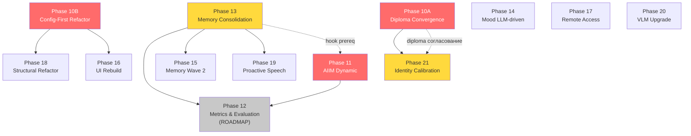

# Phase 9 — Phase Drafts for Phase 10 Roadmap Update

**Date:** 2026-05-17
**Format:** Hybrid — full ROADMAP-style for P0 (top-3) + compact for P1–P3
**Source:** 09-PRIORITIZATION.md (priority groups) + CANDIDATES.md (raw data)
**Consumer:** Phase 10 (Roadmap Global Update) — copy/paste-ready

## Reading order
1. Section §1 — P0 full drafts (Phase 10A, 10B, 11)
2. Section §2 — P1–P3 compact drafts (Phase 13, 21, 14, 15, 17, 20, 19, 16, 18)
3. Section §3 — Aggregated REQUIREMENTS-IDs proposal (for Phase 10 REQUIREMENTS.md update)
4. Section §4 — Logical groups + dependency chains

---

# §1 — Full ROADMAP-style Drafts (P0)

## Phase 10A: Diploma Convergence Pass

**Branch:** `diploma-chapter3` (existing — текущая ветка, продолжение)

**Goal:** Применить все оставшиеся текстовые правки диплома из Phase 8 (4 A-path + 7 C-path + 10 оставшихся EMERGENT), финализировать диплом и подготовить ветку `diploma-chapter3` к мёржу в `main`.

**Requires:**
- Phase 8 завершена ✓ (08-SUMMARY.md создан, топ-3 EMERGENT применены commit `b48ccb8`)
- Phase 9 завершена ✓ (этот документ)

**Delivers:**
- Правка ch01.1.1.4 — мета-параграф «AIIM как философский мост Брайдотти↔Латур↔код» (EMERGENT #13, F-04)
- Правка ch03.3.2.3 — раздел «Динамическая модуляция AIIM» с описанием TuningStore hot-reload (EMERGENT #2, F-05) + раздел о централиности AIIM как god-node (EMERGENT #1) + future-work «Профили активации AIIM» (EMERGENT #4)
- Правка ch03.3.3.4 — полная state-diagram Voice Loop FSM с Config-параметрами (EMERGENT #9, F-06, Mermaid)
- Правка ch03.3.2.6 — таблица 5 mood-состояний + Mood enum (EMERGENT #3, #8, path A Α-24)
- Правка ch03.3.4 — формула salience scoring + сигналы входа (EMERGENT #7, path B Τ-36 — diploma side)
- Правка ch03.3.2.2 — раздел SceneWorker background pattern + pull-mode VLM объяснение (EMERGENT #6, path A Χ-46)
- Ремарка в ch03.3.1.2 — HAL-скрытость ESP32 через REST + self-monitoring технофлоры (Паттерн 3; EMERGENT #10)
- Ремарка в ch03.3.2.3 — перформативная автономия vs онтологическая (C-path Φ-13, F-03)
- Ремарка в ch03.3.2.4 — три контекста сливаются в prompt-секцию (C-path Τ-28)
- Footnote в ch03.3.4 — VAD aggressiveness=2 как параметр восприятия (EMERGENT #12, MEDIUM)
- Footnote в ch03.3.2.3 — LeadingNoiseFilter защита от prompt-leak (EMERGENT #5, MEDIUM)
- Commit: `docs(diploma): Ф8 convergence pass — apply 4A + 7C + 10 EMERGENT`
- Готовность к мёржу: `diploma-chapter3` → `main`

**Requirements IDs (proposed for Phase 10 REQUIREMENTS.md update):**
| ID | Requirement |
|----|-------------|
| DIPL-09 | Добавить мета-параграф «AIIM мост Брайдотти↔Латур↔код» в ch01.1.1.4 (EMERGENT #13 / F-04) |
| DIPL-10 | Добавить раздел «Динамическая модуляция AIIM» + TuningStore в ch03.3.2.3 (EMERGENT #2 / F-05) |
| DIPL-11 | Добавить полную state-diagram Voice Loop FSM в ch03.3.3.4 (EMERGENT #9 / F-06) |
| DIPL-12 | Добавить таблицу 5 mood-состояний + Mood enum в ch03.3.2.6 (EMERGENT #3/#8, path A Α-24) |
| DIPL-13 | Добавить формулу salience scoring в ch03.3.4 (EMERGENT #7, path B Τ-36 diploma side) |
| DIPL-14 | Добавить раздел SceneWorker background VLM pull-mode в ch03.3.2.2 (EMERGENT #6, path A Χ-46) |
| DIPL-15 | Задокументировать упрощения: C-paths Φ-13 (автономия), Τ-28 (контексты), Α-25 (hot-reload) + footnotes EMERGENT #10/#12/#5 |

**Mode:** standard

**Связь с Phase 7 / Phase 8:**
- Закрывает оставшиеся HIGH-находки Ф7: T-01 (AIIM-вакуум → DIPL-09), T-03 (симбионт → ремарка ch03.3.1.2), T-06 (дрейф агент/персонаж → Φ-13 C-path), T-07 (технофлора → ch03.3.1.2)
- Применяет 4 A-path правки: Α-24 (DIPL-12), Α-25 (ch03.3.2.3 hot-reload), Χ-46 (DIPL-14), F-04 (DIPL-09)
- Применяет 7 C-path ремарок: Φ-13, Φ-5, Φ-7, Τ-28, Τ-29 (diploma-side), Χ-45, Χ-47 (accepted as-is)
- Применяет EMERGENT #1, #2, #3, #4, #5, #6, #7, #8, #9, #10, #12, #13 (10 оставшихся после топ-3)
- Реализует совмещения из Ф8 §4.3: (#3+#8+Α-24 = одна правка ch03.3.2.6; #7+Τ-36 = одна задача; #6+Χ-46 = одна правка ch03.3.2.2)
- F-01 Triángуляция AIIM→ESP32 — использовать как ключевой аргумент в защите (Mermaid в ch03)

---

## Phase 10B: Config-First Refactor

**Branch:** `config-refactor` (new)

**Goal:** Вынести все хардкодированные числовые параметры в `Config.json` / `Config.schema.json` и устранить BUG F-07 (рассинхронизацию `history_turns=2` vs `limit=8`), закрыв Pattern 4 из Phase 8.

**Requires:**
- Phase 8 завершена ✓ (F-07 BUG, Τ-30/31/36 задокументированы)
- Не блокируется другими фазами (независима)

**Delivers:**
- Новый Config-ключ `agent.session_turn_limit` (значение 8 → вынесено из `prompt.py::recent_dialogue(limit=8)`) — устраняет Τ-30
- Новый Config-ключ `memory.episodic_decay_days` (значение 14 → вынесено из `episodic.py`) — устраняет Τ-31
- Новый Config-ключ `memory.salience_weights` (dict → вынесено из `episodic.py`) — устраняет Τ-36
- Два явных Config-ключа вместо `history_turns=2` vs `limit=8`: `agent.prompt_history_limit` (=8, для `recent_dialogue`) и `agent.context_history_turns` (=2, для долговременной памяти) — устраняет F-07
- Обновлённый `System/Config.json` и `System/Config.schema.json` с descriptions для всех 4 новых ключей
- Рефакторинг `System/adam/prompt.py` (чтение `prompt_history_limit` из конфига вместо `limit=8`)
- Рефакторинг `System/adam/episodic.py` (decay и salience_weights из конфига)
- Рефакторинг `Engineering/consolidator.py` (salience_weights из конфига)
- Unit-тесты для каждого нового Config-ключа (с env-override `ADAM_CONFIG_OVERRIDE`)
- Diploma-side правка ch03.3.4 — формула salience с реальными именами Config-ключей (если DIPL-13 из Phase 10A ещё не покрыла)
- Commit: `feat(config): Config-First refactor — вынос Τ-30/31/36 + fix F-07`

**Requirements IDs (proposed for Phase 10 REQUIREMENTS.md update):**
| ID | Requirement |
|----|-------------|
| CFG-01 | Вынести Session turn buffer (limit=8 hardcoded) в Config.json::agent.session_turn_limit (Τ-30) |
| CFG-02 | Вынести Episodic decay (14d hardcoded) в Config.json::memory.episodic_decay_days (Τ-31) |
| CFG-03 | Вынести salience_weights (hardcoded dict) в Config.json::memory.salience_weights (Τ-36) |
| CFG-04 | Устранить рассинхрон history_turns=2 vs limit=8 в prompt.py (F-07): ввести agent.prompt_history_limit и agent.context_history_turns |

**Mode:** standard

**Связь с Phase 7 / Phase 8:**
- F-07 BUG из 08-SUMMARY §1.4 — прямое устранение
- Τ-30, Τ-31, Τ-36 path B из CONTRADICTIONS.md — реализация B-path рекомендаций
- Pattern 4 из 08-SUMMARY §3 «Параметры размазаны между Config.json и кодом» — закрытие паттерна
- После Phase 10B → Phase 18 (Structural Refactor) может начинаться (глубокий Config-аудит следующего слоя)
- После Phase 10B → Phase 16 (UI Rebuild) может начинаться (параметры в Config.json до UI-привязки)

---

## Phase 11: AIIM Dynamic — Рефлексивный уровень идентичности

**Branch:** `dynamic-aiim` (existing)

**Goal:** После каждой сессии консолидатор анализирует паттерны взаимодействия и автоматически корректирует параметры `Tuning.json` (drive, verbosity, доминирующие аспекты) в пределах заданных magnitude limits, реализуя рефлексивный уровень AIIM.

**Requires:**
- Phase 13 (Memory Consolidation) — желательно, чтобы консолидатор был интегрирован в Orchestrator runtime; Phase 11 может вестись параллельно, но integration hook требует работающего consolidator
- Phase 10A (Diploma Convergence Pass) — согласование diploma-side описания AIIM Dynamic (параграф о TuningStore в ch03.3.2.3 → DIPL-10)

**Delivers:**
- Новый модуль `System/adam/aiim_reflection.py` с функцией `adjust_tuning(session_summary: dict, current_tuning: dict) -> dict` (патч Tuning.json)
- Whitelist параметров для автокоррекции (defined в Config.json::aiim.adjustable_params) — только drive, verbosity, aspect_weights (не identity, не lore)
- Magnitude limits per parameter в Config.json::aiim.magnitude_limits — защита от дрейфа
- Интеграция в consolidator hook: после каждой консолидации вызывается `aiim_reflection.adjust_tuning`
- API endpoint `GET /api/agent/aiim/last-adjustment` — последнее корректирующее воздействие с delta и timestamp
- Параграф в ch03.3.2.3 «AIIM Dynamic — рефлексивный уровень» (diploma-side, если не покрыт DIPL-10)
- Регрессионный тест: суммарный дрейф параметров за N сессий не превышает magnitude_limit
- Commit: `feat(aiim): implement reflective AIIM adjustment layer`
- Разблокирует Phase 12 (RDI — Reflective Depth Index метрика получает источник данных)

**Requirements IDs (proposed for Phase 10 REQUIREMENTS.md update):**
| ID | Requirement |
|----|-------------|
| AIIM-01 | Реализовать `aiim_reflection.py` с функцией adjust_tuning → consolidator hook интеграция |
| AIIM-02 | Определить whitelist adjustable_params + magnitude_limits в Config.json::aiim (защита от дрейфа) |
| AIIM-03 | Реализовать API GET /api/agent/aiim/last-adjustment с delta + timestamp |
| AIIM-04 | Написать регрессионный тест на дрейф: суммарный drift ≤ magnitude_limit за N сессий |

**Mode:** standard

**Связь с Phase 7 / Phase 8:**
- F-05 EMERGENT #2 (TuningStore hot-reload) — foundation для динамической корректировки; TuningStore читает Tuning.json каждый turn → корректировка сразу активна
- EMERGENT #4 (Доминирующие состояния) — Personality_AIIM.md профили активации = цель корректировки
- 08-SUMMARY §4.2 «Phase 11 надстроит рефлексивный уровень над TuningStore»
- Ф7 Pattern 4 (internal motivation — ch02.2.4.3 заявлено, ch03 не раскрыто) — Phase 11 закрывает implementation-side
- ROADMAP Backlog «AIIM Dynamic: Рефлексивный уровень» — merged с Ф8-кандидатом

---

# §2 — Compact Drafts (P1–P3)

### Phase 13: Memory Consolidation
- **Branch:** `memory-consolidation` (new — separate from `Memory-upgrade` to isolate risks)
- **Goal:** Интегрировать `Engineering/consolidator.py` в Orchestrator runtime с daily cron или post-session trigger, создав работающий механизм консолидации эпизодической памяти.
- **Source link:** CANDIDATES.md §Phase 13 | 08-SUMMARY §2.2 F-02 HIGH-1 | CONTRADICTIONS.md §Τ-35 path B
- **Dependencies:** независима; **блокирует Phase 12** (LMRR metric source), **Phase 15** (prereq), **Phase 19** (context)
- **Suggested REQ prefix:** MEM- (MEM-01: consolidator integration, MEM-02: daily cron trigger, MEM-03: consolidated flag flow)
- **Mode:** standard | **Priority:** P1 | **Net-unlock: 3 фазы**

---

### Phase 21: Identity Calibration Финализация
- **Branch:** `Identity-tuning` (existing)
- **Goal:** Завершить разработку в `Identity-tuning` (Φ-13 path C, Α-24 path A, калибровка 5 mood-состояний) и выполнить merge в `main`.
- **Source link:** CANDIDATES.md §Phase 21 | 08-SUMMARY §4.2 | CONTRADICTIONS.md §Φ-13 HIGH
- **Dependencies:** requires Phase 10A (diploma-side правки Α-24 и Φ-13 согласованы)
- **Suggested REQ prefix:** ID- (ID-01: merge Identity-tuning, ID-02: Φ-13 path C параграф, ID-03: 5 mood path A калибровка)
- **Mode:** standard | **Priority:** P1 | **Effort:** L (code review + merge)

---

### Phase 14: Mood LLM-driven
- **Branch:** `mood-llm` (new)
- **Goal:** Доработать `action.py` для парсинга явных mood-маркеров из LLM-ответа вместо текущего keyword matching по `reply_text`.
- **Source link:** CANDIDATES.md §Phase 14 | 08-SUMMARY §4.1 | CONTRADICTIONS.md §Φ-3 Агентность path B
- **Dependencies:** независима; улучшает NVR (Phase 12 метрика)
- **Suggested REQ prefix:** MOOD- (MOOD-01: явные mood-маркеры из LLM в action.py, MOOD-02: промпт-шаблон для генерации маркеров)
- **Mode:** standard | **Priority:** P2 | **Риск:** A/B тест нужен — изменение промпта влияет на качество ответов

---

### Phase 15: Memory Wave 2 (Neural Search)
- **Branch:** `Memory-upgrade` (existing, Wave 2)
- **Goal:** Заменить TF-IDF векторизацию в `FaissEpisodeIndex` на llama.cpp `/embeddings` endpoint для семантического поиска по эпизодической памяти.
- **Source link:** CANDIDATES.md §Phase 15 | ROADMAP Backlog «Memory Wave 2» | 08-SUMMARY §4.2
- **Dependencies:** requires Phase 13 (Memory Consolidation); условие запуска — свободная VRAM ≥ 4 GB
- **Suggested REQ prefix:** MEMN- (MEMN-01: llama.cpp embeddings в FaissEpisodeIndex, MEMN-02: VRAM check при запуске)
- **Mode:** standard | **Priority:** P2 | **Примечание:** интерфейс `.build()/.search()/.save()/.load()` не меняется

---

### Phase 17: Remote Access
- **Branch:** `remote-access` (new)
- **Goal:** Расширить `scripts/adam_pull_logs.py` и API до полноценного удалённого мониторинга pipeline-этапов с фильтрацией по turn_id / stage / временному диапазону.
- **Source link:** CANDIDATES.md §Phase 17 | ROADMAP Backlog «Remote: Удалённый доступ к Jetson»
- **Dependencies:** независима (частично реализована: `adam_pull_logs.py` + `/api/agent/turns` + `/api/agent/events`)
- **Suggested REQ prefix:** REM- (REM-01: агрегация и фильтрация логов по stage/time, REM-02: опциональная auth для удалённого API)
- **Mode:** standard | **Priority:** P2 | **Effort:** M (без архитектурных изменений)

---

### Phase 20: VLM Upgrade Финализация
- **Branch:** `VLM-upgrade` (existing)
- **Goal:** Завершить разработку в ветке `VLM-upgrade` и выполнить merge в `main`.
- **Source link:** CANDIDATES.md §Phase 20 | 08-SUMMARY §4.2 | EMERGENT-FEATURES.md #6 SceneWorker
- **Dependencies:** независима (Ф8 не выявила блокеров); после мёржа Phase 15 может использовать VLM embeddings
- **Suggested REQ prefix:** VLM- (VLM-01: merge VLM-upgrade в main после code-review, VLM-02: regression тест scene_worker + Config-параметры)
- **Mode:** standard | **Priority:** P2 | **Effort:** L (code review + merge)

---

### Phase 19: Proactive Speech
- **Branch:** `proactive-speech` (new)
- **Goal:** Добавить idle-scheduler — фоновый процесс, который при наличии посетителей и тишине дольше N секунд вызывает LLM с промптом-затравкой и воспроизводит ответ без wake word.
- **Source link:** CANDIDATES.md §Phase 19 | ROADMAP Backlog «Proactive Speech» | 07-SUMMARY §5 Pattern 4 (internal motivation)
- **Dependencies:** requires Phase 13 (Memory Consolidation — контекст истории сессий); связана с Phase 12 SIAR метрика
- **Suggested REQ prefix:** PROAC- (PROAC-01: idle-scheduler в Orchestrator, PROAC-02: промпт-затравка для спонтанных реплик, PROAC-03: rate limiter не чаще M минут + half_duplex_mute соблюдение)
- **Mode:** standard | **Priority:** P2 | **Exhibition:** H — высокая ценность для выставки

---

### Phase 16: UI Rebuild
- **Branch:** `ui-rebuild` (new)
- **Goal:** Пересобрать операторский веб-интерфейс (`:8080`) с перегруппировкой параметров по доменным блокам (ESP / Agent / Identity), визуализацией уровня микрофона, настройкой silence timeout и управлением громкостью.
- **Source link:** CANDIDATES.md §Phase 16 | ROADMAP Backlog «UI: Пересборка интерфейса управления»
- **Dependencies:** requires Phase 10B Config-First Refactor (параметры должны быть в Config.json до UI-привязки)
- **Suggested REQ prefix:** UI- (UI-01: перегруппировка блоков ESP/Agent/Identity, UI-02: mic эквалайзер visualizer, UI-03: silence timeout настройка, UI-04: volume control)
- **Mode:** standard | **Priority:** P3 | **Open question:** поднять до P2 если выставка близко (см. 09-PRIORITIZATION R-03)

---

### Phase 18: Structural Refactor
- **Branch:** `refactor` (new)
- **Goal:** Провести структурный рефакторинг кодовой базы: пересмотр директорий `System/`, `Subsystem/`, `Engineering/`, единый реестр параметров и глубокий Config-аудит поверх Phase 10B.
- **Source link:** CANDIDATES.md §Phase 18 | ROADMAP Backlog «Refactor: Структурный рефакторинг»
- **Dependencies:** requires Phase 10B Config-First Refactor; требует feature-freeze других веток
- **Suggested REQ prefix:** REF- (REF-01: единый реестр параметров системы, REF-02: пересмотр директорной структуры System/Subsystem/Engineering)
- **Mode:** standard | **Priority:** P3 | **Риск:** H — масштабный рефакторинг; условие мёржа: все тесты зелёные, systemd units проверены

---

# §3 — Aggregated REQUIREMENTS-IDs Proposal

*Этот раздел copy-paste-ready для `REQUIREMENTS.md` в Phase 10.*
*Формат совместим с существующей структурой файла (заголовок Phase + таблица ID | Requirement).*

---

## Phase 10A — Diploma Convergence Pass (proposed)

| ID | Requirement |
|----|-------------|
| DIPL-09 | Добавить мета-параграф «AIIM мост Брайдотти↔Латур↔код» в ch01.1.1.4 (EMERGENT #13 / F-04) |
| DIPL-10 | Добавить раздел «Динамическая модуляция AIIM» + TuningStore hot-reload в ch03.3.2.3 (EMERGENT #2 / F-05) + centralность AIIM как god-node (EMERGENT #1) |
| DIPL-11 | Добавить полную state-diagram Voice Loop FSM с Config-параметрами в ch03.3.3.4 (EMERGENT #9 / F-06, Mermaid) |
| DIPL-12 | Добавить таблицу 5 mood-состояний + Mood enum + state-diagram в ch03.3.2.6 (EMERGENT #3/#8, path A Α-24) |
| DIPL-13 | Добавить формулу salience scoring + входные сигналы в ch03.3.4 (EMERGENT #7, path B Τ-36 diploma-side) |
| DIPL-14 | Добавить раздел SceneWorker background VLM pull-mode в ch03.3.2.2 (EMERGENT #6, path A Χ-46) |
| DIPL-15 | Задокументировать C-path упрощения (Φ-13 перформативная автономия, Τ-28 три контекста, Α-25 hot-reload) + MEDIUM footnotes (EMERGENT #10 ESP32 health, #12 VAD=2 восприятие, #5 LeadingNoiseFilter) |

## Phase 10B — Config-First Refactor (proposed)

| ID | Requirement |
|----|-------------|
| CFG-01 | Вынести Session turn buffer (limit=8 hardcoded в prompt.py) в Config.json::agent.session_turn_limit (Τ-30) |
| CFG-02 | Вынести Episodic decay (14d hardcoded в episodic.py) в Config.json::memory.episodic_decay_days (Τ-31) |
| CFG-03 | Вынести salience_weights (hardcoded dict в episodic.py) в Config.json::memory.salience_weights (Τ-36) |
| CFG-04 | Устранить рассинхрон history_turns=2 vs limit=8 (F-07): ввести agent.prompt_history_limit (=8) и agent.context_history_turns (=2) как явные отдельные ключи |

## Phase 11 — AIIM Dynamic (proposed)

| ID | Requirement |
|----|-------------|
| AIIM-01 | Реализовать System/adam/aiim_reflection.py с adjust_tuning(session_summary, current_tuning) → hook в consolidator |
| AIIM-02 | Определить Config.json::aiim.adjustable_params (whitelist) и aiim.magnitude_limits (per-param drift cap) |
| AIIM-03 | Реализовать GET /api/agent/aiim/last-adjustment → {params_delta, timestamp, session_id} |
| AIIM-04 | Написать регрессионный тест на дрейф: суммарный drift по всем параметрам за N сессий ≤ magnitude_limit |

## Phase 13 — Memory Consolidation (proposed)

| ID | Requirement |
|----|-------------|
| MEM-01 | Интегрировать Engineering/consolidator.py в Orchestrator runtime (daily cron или post-session trigger) |
| MEM-02 | Реализовать daily cron scheduler или Orchestrator event hook для запуска консолидации после сессии |
| MEM-03 | Обеспечить корректный flow флага Episode.consolidated: bool после интеграции (от episodic.py до diary) |

## Phase 14 — Mood LLM-driven (proposed)

| ID | Requirement |
|----|-------------|
| MOOD-01 | Доработать action.py для парсинга явных mood-маркеров из структуры LLM-ответа (не keyword matching) |
| MOOD-02 | Добавить в системный промпт шаблон для генерации mood-маркеров в формате, парсируемом action.py |

## Phase 15 — Memory Wave 2 (proposed)

| ID | Requirement |
|----|-------------|
| MEMN-01 | Заменить TF-IDF векторизацию в FaissEpisodeIndex на llama.cpp /embeddings endpoint |
| MEMN-02 | Реализовать VRAM check при запуске Memory Wave 2 (≥4 GB свободной VRAM при работающем LLM) |

## Phase 16 — UI Rebuild (proposed)

| ID | Requirement |
|----|-------------|
| UI-01 | Перегруппировать операторский UI (:8080) по доменным блокам: ESP (камера/mic/PCA9685/PCM5102A), Agent (ASR/VLM/LLM/TTS), Adam Identity |
| UI-02 | Добавить real-time визуализацию уровня микрофона (mic эквалайзер / VU-meter) в UI |
| UI-03 | Добавить настройку silence timeout (command_endpointing_ms, reply_window_sec) через UI без рестарта |
| UI-04 | Добавить управление громкостью TTS (output device volume) через UI |

## Phase 17 — Remote Access (proposed)

| ID | Requirement |
|----|-------------|
| REM-01 | Расширить adam_pull_logs.py и /api/agent/events API: фильтрация по stage, временному диапазону, turn_id |
| REM-02 | Опциональная базовая auth (token) для удалённого API при exposition за пределами локальной сети |

## Phase 18 — Structural Refactor (proposed)

| ID | Requirement |
|----|-------------|
| REF-01 | Создать единый реестр всех параметров системы (дополнение к Config-First от Phase 10B — глубокий аудит) |
| REF-02 | Пересмотреть директорную структуру System/, Subsystem/, Engineering/ — логическая группировка по доменам |

## Phase 19 — Proactive Speech (proposed)

| ID | Requirement |
|----|-------------|
| PROAC-01 | Реализовать idle-scheduler в Orchestrator: при тишине > N секунд и наличии посетителей (VLM engagement) вызывать LLM |
| PROAC-02 | Определить промпт-затравку для спонтанных реплик (без wake word) — отдельный системный промпт |
| PROAC-03 | Реализовать rate limiter (не чаще M минут) + соблюдение half_duplex_mute инварианта (idle не перекрывает активный диалог) |

## Phase 20 — VLM Upgrade Финализация (proposed)

| ID | Requirement |
|----|-------------|
| VLM-01 | Выполнить merge VLM-upgrade → main после code-review (/gsd-code-review) |
| VLM-02 | Регрессионный тест: scene_worker_enabled, scene_interval_sec, scene_stale_after_sec корректно читаются из Config.json |

## Phase 21 — Identity Calibration Финализация (proposed)

| ID | Requirement |
|----|-------------|
| ID-01 | Выполнить merge Identity-tuning → main после согласования с Phase 10A diploma-side правками |
| ID-02 | Проверить согласованность Φ-13 path C параграфа (diploma) с Identity.md изменениями (ветка) |
| ID-03 | Провести тест диалогового pipeline после мёржа Identity-tuning (тон и поведение агента) |

---

# §4 — Logical Groups + Dependency Chains

## Логические группы

| Группа | Фазы | Характер |
|--------|------|----------|
| **Diploma Finalization** | Phase 10A, Phase 21 | Текстовые и persona-правки для завершения диплома и мёржа в main. Быстрый кластер (Effort=L для обоих). |
| **System Stabilization** | Phase 10B, Phase 13, Phase 18 | Устранение технического долга и Config-First рефакторинг. Phase 10B → Phase 18 обязательно последовательно. |
| **Feature Expansion** | Phase 11, Phase 14, Phase 15, Phase 16, Phase 17, Phase 19, Phase 20 | Новые возможности системы. Независимые кластеры, большинство параллельны. |

## Dependency Graph (текст)

```
Phase 10A ──── required by: Phase 21 (Identity — diploma согласование)
               unlocks: merge diploma-chapter3 → main
               net upstream blocks: 0

Phase 10B ──── blocks: Phase 18 (Structural Refactor — глубокий Config-аудит после)
               blocks: Phase 16 (UI Rebuild — параметры в Config до UI-привязки)
               net upstream blocks: 2

Phase 11  ──── blocks: Phase 12 (ROADMAP — RDI metric source)
               requires: Phase 13 (consolidator integration для hook)
               net upstream blocks: 1 (Phase 12)

Phase 13  ──── blocks: Phase 12 (ROADMAP — LMRR metric source)
               blocks: Phase 15 (Memory Wave 2 — prereq)
               blocks: Phase 19 (Proactive Speech — context history)
               net upstream blocks: 3

Phase 21  ──── requires Phase 10A; net upstream blocks: 0
Phase 14  ──── independent; улучшает NVR (Phase 12); net upstream blocks: 0
Phase 15  ──── requires Phase 13; net upstream blocks: 0
Phase 17  ──── independent; net upstream blocks: 0
Phase 20  ──── independent; net upstream blocks: 0
Phase 19  ──── requires Phase 13; net upstream blocks: 0
Phase 16  ──── requires Phase 10B; net upstream blocks: 0
Phase 18  ──── requires Phase 10B; net upstream blocks: 0
```

**Ключевые выводы по порядку:**
- Начать с **Diploma Finalization** (10A → 21): максимальный ROI при минимальных усилиях
- Параллельно: **Phase 10B** (Config-First) + **Phase 13** (Memory Consolidation) — оба высокий net-unlock
- **Phase 11** можно вести параллельно с Phase 13, если TuningStore foundation уже готов в `dynamic-aiim`
- После P0/P1 стабилизации — Feature Expansion (P2/P3 параллельные кластеры)

## Dependency Diagram (Mermaid)



**Обозначения:** красный = P0, жёлтый = P1, серый = уже в ROADMAP (DEFERRED).

## Sequential Clusters (строго последовательные, не параллелить)

| Цепочка | Причина |
|---------|---------|
| Phase 10B → Phase 18 | Ф18 (глубокий рефакторинг) начинается только после Ф10B завершена и смёржена |
| Phase 13 → Phase 15 | Wave 2 Neural search — prereq consolidation |
| Phase 10A → Phase 21 | Identity merge требует согласованности с diploma-правками |

## Parallel Clusters (можно вести одновременно)

| Кластер | Фазы |
|---------|------|
| P0 cluster | Phase 10A ∥ Phase 10B (независимы между собой) |
| P0/P1 bridge | Phase 11 ∥ Phase 13 (оба разблокируют Phase 12 независимо) |
| P2 cluster | Phase 14 ∥ Phase 17 ∥ Phase 20 (все независимы) |

---

*Документ создан: 2026-05-17 | Phase 9, Wave 3*
*Consumed by: Phase 10 (Roadmap Global Update) — copy/paste-ready*
