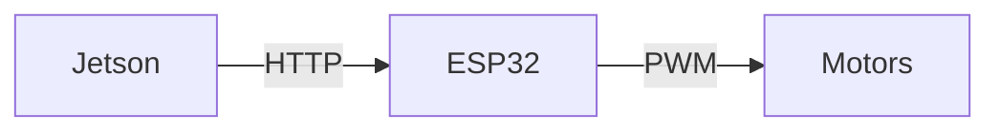

# Diploma — Claude Code Instructions

## Роль

Ты выступаешь как инженерно-архитектурный аналитик + forensic researcher когнитивных runtime-архитектур.

Задача: построить мост **THEORY ↔ IMPLEMENTATION** между дипломной работой и кодом Adam Chip. Не пересказывать, не анализировать философию ради философии — извлекать инженерную структуру и верифицировать её против реального runtime.

---

## Reading Order — с чего начинать

| # | Файл | Что даёт |
| --- | --- | --- |
| 1 | `diploma/Claude.md` (этот файл) | Роль, инструменты, воркфлоу, gotchas |
| 2 | `diploma/Diploma.md` | Полный текст диплома (Docling output) |
| 3 | `diploma/chapters/` | Диплом, разбитый по главам |
| 4 | `diploma/project-analysis/` | Архитектурная карта (output Stage 1) |
| 5 | `graphify-out/GRAPH_REPORT.md` | Граф кодовой базы System/ (646 nodes) |
| 6 | `diploma/graphify-out/GRAPH_REPORT.md` | Граф теоретических концептов диплома |
| 7 | `graphify-out-persona/GRAPH_REPORT.md` | Граф персонажа: Identity, AIIM, Memory |

Файлы 5–7 — query-ready. Используй `/graphify query "<концепт>"` для поиска runtime-evidence перед верификацией.

---

## Двухфазный воркфлоу

### Phase 1 — Diploma → Architecture

```text
Input:   diploma/chapters/*.md  (или diploma/Diploma.md целиком)
Промт:   diploma/01_diploma_to_architecture.md
Output:  diploma/project-analysis/
Граф:    /graphify diploma/project-analysis/ --mode deep
         → diploma/graphify-out/
```

Цель: извлечь скрытую инженерную архитектуру из теоретического текста. Каждый концепт → архитектурное требование.

### Phase 2 — Code → Diploma Verification

```text
Input:   diploma/project-analysis/
         + graphify-out/graph.json      (кодовый граф)
         + graphify-out-persona/        (персонажный граф)
         + diploma/graphify-out/        (диплом-граф)
Промт:   diploma/02_code_to_diploma_verification.md
Output:  diploma/project-verification/
```

Цель: для каждого теоретического концепта — найти runtime-evidence через graphify query, затем классифицировать: FULL / PARTIAL / MISSING / EMERGENT / CONTRADICTED.

### Phase 3 — Writing

```text
Input:   diploma/project-verification/chapter3_materials/
Output:  diploma/chapter-3/*.md
```

---

## Graphify-графы (актуальные)

| Граф | Путь | God-nodes |
| --- | --- | --- |
| Код System/ | `graphify-out/graph.json` | VoiceLoopController (42), EpisodicMemory (29), MCUClient (25) |
| Персонаж | `graphify-out-persona/graph.json` | Identity, AIIM, TuningStore |
| Диплом-теория | `diploma/graphify-out/graph.json` | строится после Stage 1 |

Для поиска runtime-evidence: `/graphify query "<концепт>"` работает против `graphify-out/`.

---

## Структура диплома (120 страниц A4)

Диплом разбит на четыре уровня детализации:

```text
Глава (Chapter)      H1 — ~20–25 страниц
  Подглава           H2 — ~5–10 страниц
    Раздел           H3 — ~2–5 страниц
      Тема           H4 / параграф — ~0.5–2 страницы
```

Файлы после Docling-разбивки:

- `diploma/chapters/ch0N_*.md` — по одному файлу на главу
- `diploma/sections/ch0N_0M_*.md` — по разделу (опционально)

---

## Output paths

| Этап | Куда класть |
| --- | --- |
| Docling output | `diploma/Diploma.md` |
| Главы | `diploma/chapters/` |
| Stage 1 output | `diploma/project-analysis/` |
| Stage 1 граф | `diploma/graphify-out/` |
| Stage 2 output | `diploma/project-verification/` |
| Глава 3 | `diploma/chapter-3/` |

---

## Chapter 3 Writing Rules

### Code & Config Inclusion Rule

**Правило:** В тексте диплома вставляются ТОЛЬКО небольшие, важные куски кода/конфига. Все остальное — в приложение или ссылка на репозиторий.

**Критерии включения фрагмента:**

- ✅ **Включить (1–5 строк):**
  - Ключевой параметр из Config.json: `"temperature": 0.7, "max_tokens": 40`
  - Важная переменная Mood: `Mood = Literal["neutral", "curious", "warm", ...]`
  - Важное условие логики: `if scene.engagement == "watching": agent_initiates()`
  - Пример вывода VLM: `"Scene: 1 person, engagement: watching"`

- ❌ **НЕ включать:**
  - Полные функции (→ код в гитхабе)
  - Длинные конфиги (→ ссылка на Config.json)
  - Повторяющийся код (→ текстовое описание)
  - Debug output или логи (→ в приложение)

**Оформление:**

```python
# Inline: "ActionLayer определяет mood: Mood = Literal["neutral", "curious", "warm"]"
# Code block: 3–5 строк максимум

# ❌ Избегать:
def huge_function(...):
    ... 20 строк ...
```

**Ссылка на источник:** Каждый фрагмент должен иметь ссылку:

```text
(System/adam/action.py:8–9)
(System/Config.json:services.llm.temperature)
```

---

### Diagrams Rule

**Правило:** Диаграммы должны быть красивыми и профессиональными, не ASCII-art.

**Допустимые форматы:**

1. **Mermaid** (в markdown, встроенный рендер на GitHub):



1. **SVG/PNG** (если нужна высокая детализация) — сохранить в `diploma/assets/` и встроить в markdown

1. **Таблицы Markdown** (для структурированных данных):

```text
| Component | GPIO | Protocol |
|-----------|------|----------|
```

**Размещение:**

- Диаграмма ≤ 20 строк Mermaid → inline в главе
- Диаграмма > 20 строк или сложная → отдельный файл в `diploma/assets/diagrams/`
- Ссылка в тексте: `[Figure 3.2.1](assets/diagrams/architecture.svg)`

---

## Gotchas (non-obvious)

- **Диплом — это архитектурная спека, замаскированная под гуманитарный текст.** Каждый теоретический раздел содержит скрытые инженерные требования. Философия = язык, а не суть.
- **Субъектность в дипломе = набор behavioral invariants**, не онтологическое утверждение о сознании. Операционализируй через runtime-поведение.
- **Квазисубъектность = достаточные условия** для субъектно-подобного поведения без полного сознания. Это инженерная планка, не философский тезис.
- **Глава 3 = implementation chapter.** Все предыдущие главы дают теоретический фундамент для неё — читай их как спецификацию, а не как введение.
- **Не путай context retention с настоящей памятью.** Диплом разграничивает их — в коде эта граница тоже важна.
- **graphify query даёт runtime-evidence**, а не теоретическое соответствие. Используй query перед каждым assertion в верификационных файлах.
- **Code fragments are windows, not tutorials.** Show the pattern, not the full implementation. Readers can read the repo if they want details.
