# 3. Разработка агента

## 3.1. Концепция проекта и художественная логика инсталляции

### 3.1.1. Концептуальная основа проекта

«Адам Чип» строится вокруг образа цифрового симбионта — сущности, пережившей смерть собственного носителя. После распада прежнего тела она сохранила фрагменты памяти, отдельные следы сознания и способность к взаимодействию, но уже в иной форме. Именно этот остаток субъекта, продолжающий существование в повреждённом и нестабильном виде, и становится предметом художественного высказывания.

Адам не мыслится как совершенная и непрерывная цифровая личность. Его работа изначально допускает сбои, паузы, задержки, неполную связность реакций и ограниченность восприятия. Эти свойства включаются в художественную логику и соответствуют самой идее симбионта, дошедшего до зрителя лишь фрагментарно — как остаток чужого сознания, уцелевший после распада прежнего тела.

При этом художественное оправдание несовершенств не отменяет требований к архитектуре. Система должна оставаться предсказуемой в основных реакциях, управляемой на уровне настройки и достаточно эффективной для устойчивого взаимодействия со зрителем. Инсталляция не скрывает условность агентного приложения, а переосмысляет её внутри общего образа посмертного цифрового остатка.

Материальное тело агента — технофлора, результат симбиоза органики и электроники, возникший на месте прежнего тела. Через неё агент проявляется вовне: то, что ранее могло бы быть описано как внутреннее состояние, здесь передаётся через материальные реакции среды: свет, звук, вибрацию. Это смещает акцент с антропоморфной модели искусственного интеллекта на экологическую и постбиологическую. «Адам Чип» не имитирует человека; он существует как инородная, но связная форма присутствия.

### 3.1.2. Логика поведения агента

Концептуальный уровень задаёт онтологический статус «Адама Чипа», поведенческий — способ его существования в художественном пространстве. Инсталляция задумывается как система, внутри которой агент непрерывно удерживает состояние, воспринимает изменения среды и в определённых пределах способен к собственной инициативе; ответ на обращение зрителя — лишь частный случай этого режима.

Зритель, входящий в поле инсталляции, меняет ситуацию самим своим присутствием. Голос, движение, приближение, длительность контакта, акустическая и визуальная обстановка становятся для системы материалом восприятия. Поведение агента строится на сочетании двух режимов: реактивного и проактивного. В реактивном агент отвечает на конкретное внешнее действие. В проактивном удерживает собственное состояние и инициирует сигналы, способные обозначить внутреннюю динамику без прямого запроса.

Это сочетание определяет художественный эффект. Чисто реактивная система быстро раскрывает свою инструментальную природу. Проактивность, даже ограниченная, меняет режим восприятия: зритель имеет дело с объектом, который уже находится в процессе собственной жизни, а не с устройством, включающимся по требованию. В этом сдвиге возникает то, что можно назвать квазисубъектным присутствием.

Форма присутствия намеренно распределена. Речь отвечает за вербальный уровень и адресность. Свет передаёт изменение состояния в пространстве, делая его зримым ещё до рациональной интерпретации. Звук создаёт фоновую среду и усиливает ощущение обитаемости. Вибрация работает тоньше: почти как телесный сигнал, рефлекс или защитная реакция. Вместе они образуют поведенческий контур, в котором агент проявляется целостной модальностью, а не одной репликой.

Отсюда отказ от приоритета текста. Убедительность возникает на пересечении модальностей: иногда зритель сначала замечает свечение или изменение акустики, а уже затем речь. Центральный принцип — управляемая связность, баланс между определённостью роли и вариативностью проявления, а не максимальная сложность.

Архитектурно стоит зафиксировать одно отсутствие: система не реализует классическую модель Belief–Desire–Intention (см. главу 1.1.3 и кейсы 2.3.1). У Адама нет структурированных убеждений как отдельной базы знаний: «истинное» растворено в системном промпте и эпизодической памяти. Нет целей в смысле явных желаний и нет намерений как устойчивых обязательств, переходящих между обращениями. Каждое решение принимается заново — в контексте текущего обращения и текущей конфигурации идентичности. Это сознательный отказ. Квазисубъект здесь конструируется через удержание роли и реакцию на дельта-события среды, а не через целеполагание.

### 3.1.3. Функции нейроагента в структуре инсталляции

Нейроагент работает как центральный интерпретатор и координатор инсталляции. Через него разнородные потоки данных — речь зрителя, визуальные сигналы, акустические изменения среды, внутренние состояния системы — собираются в единую модель текущей ситуации.

Базовых функций пять. Восприятие — фиксация обращений и значимых событий, перевод сенсорного потока в форму, пригодную для поведенческого решения. Интерпретация — соотнесение входного сигнала с ролью, состоянием и накопленным контекстом; одна и та же реплика в разных условиях получает разные трактовки. Речевая генерация — формирование адресной реплики, через которую проявляются характер, дистанция и интонация. Командная генерация — формирование исполнительных сигналов для технофлоры; свет, звук и вибрация работают как равноправная часть поведения, а не как декоративное сопровождение речи. Удержание поведенческой линии — связывание отдельных эпизодов взаимодействия в последовательность, сохранение характера и непрерывности присутствия во времени.

## 3.2. Разработка нейроагентного приложения

### 3.2.1. Общая архитектура приложения

Приложение построено как модульная система: вычислительное ядро, память, перцептивные контуры, речевой интерфейс и исполнительная логика связаны единым оркестратором. В интерактивной инсталляции разные типы данных поступают асинхронно, обрабатываются с разной скоростью и требуют разных режимов реакции. За базовый принцип взята событийная архитектура.

В центре приложения — модуль `Orchestrator.py`. Сам он ответы не генерирует, но управляет их появлением: принимает сигналы перцептивных модулей, инициирует сбор контекста, запускает обращение к языковой модели, получает результат и передаёт его в постобработку. Оркестратор работает как диспетчер состояний: определяет, когда событие следует считать значимым, в какой последовательности запускать распознавание, генерацию, синтез речи и команды микроконтроллеру.

Внутренняя структура разделена на функциональные области. Блок «Speech» (речевые модули) отвечает за распознавание и синтез речи. Блок «Interlayers» (промежуточные слои) содержит сборщик промпта и слой действий. Папка «Memory» (блок памяти) хранит уровни памяти: текущую историю, заметки, интервальные обобщения и постоянные текстовые основания личности. В «Tools» (служебные утилиты) сосредоточены модули связи с внешними устройствами. Отдельно располагается «Subsystem» (подсистема ESP32) с прошивкой микроконтроллера.

Согласование обеспечивает общая событийная шина `events.py`. Модули публикуют структурированные события: старт распознавания, завершение генерации, отправка моторной команды, ошибки. Каждое событие получает идентификатор цикла `turn_id`, по которому собирается вся последовательность действий одного обращения. Шина одновременно пишет события в постоянный журнал и в кольцевой буфер в памяти, к которому подключаются операторский интерфейс и сервис просмотра логов. Ни один модуль не вызывает другой напрямую — модули остаются независимыми, а связность поведения собирается наблюдением за общей шиной. Событийная шина вместо прямых вызовов операционализирует представление о распределённой агентности, развёрнутое в первой главе (1.1.4, 2.1.8).

Содержательно цикл выглядит так. Сигнал приходит из среды: через голос, изображение, фоновое состояние датчиков или внутреннюю проактивную логику. Оркестратор инициирует обработку перцептивного слоя. Формируется текстовый контекст: системный промпт, данные памяти, состояние агента, релевантные наблюдения среды, фраза зрителя. На этом контексте языковая модель генерирует единый ответ. Текстовая часть уходит в синтез речи, краткие маркеры состояния — в исполнительный контур. В конце цикла память обновляется, состояние агента пересчитывается, система возвращается в режим ожидания (рисунок 3.2.1).



### 3.2.2. Программный стек и логика реализации

Вычислительная часть реализуется на микрокомпьютере NVIDIA Jetson Orin NX 16 ГБ под Ubuntu 22.04 с пакетом JetPack, обеспечивающим поддержку CUDA-ядер для ресурсоёмких задач. Приложение одновременно работает с языковой моделью, визуальным анализом, речевой обработкой и обменом данными с исполнительной частью.

Сервисы изолированы в контейнерах ради стабильности и повторяемости окружения. В интерактивной инсталляции, рассчитанной на длительную работу, нежелательны конфликты модулей из-за зависимостей; контейнеризация упрощает обновления и позволяет жёстко контролировать распределение ресурсов Jetson.

Основным движком языковой модели выбран llama.cpp — за скорость инференса и режим, близкий к реальному времени. Используется модель Gemma 4 E4B (квантизация UD-Q4_K_XL, около 3 ГБ оперативной памяти). У неё гибридный механизм внимания: глобальное самовнимание перемежается с самовниманием в скользящем окне 512 токенов. Особенность — кэш ключей и значений сбрасывается между обращениями, и системный промпт заново подаётся в модель целиком. На Jetson Orin NX это даёт задержку начальной загрузки контекста около 9 секунд при длине промпта порядка 2800 токенов. Режим явных размышлений в выставочной конфигурации отключён, поскольку направляет вывод в скрытое поле и нарушает требование чистой русской реплики.

Параллельно в отдельном контейнере на nano_llm работает визуально-языковая модель VILA 1.5-3b. Она быстро даёт предварительное текстовое описание сцены, которое затем включается в контекст основного обращения к llama.cpp. Такое разведение решает две задачи: не перегружать агентное ядро прямой обработкой видеопотока и сохранять высокую скорость реакции, когда для ответа достаточно краткой интерпретации сцены. Быстрая визуальная модель выполняет функцию разведки, основная — интерпретации и принятия решения.

Языком оркестрации выбран Python — он позволяет быстро собирать и перестраивать логику приложения. Операторская часть реализована как лёгкий веб-интерфейс на FastAPI (порт 8080): запуск и остановка оркестратора, статусы модулей, просмотр последних обращений, очистка истории, проверка связи с микроконтроллером. Отдельный сервис на порту 8083 показывает диагностические логи и не зависит от основного оркестратора — он читает события из общей шины напрямую и продолжает работать даже при падении основного цикла. Управление фоновыми сервисами реализовано через тонкую обёртку над systemd: оператор перезапускает или останавливает любой из них прямо из веб-интерфейса.

Стек образует три уровня. Вычислительный: Jetson, CUDA, контейнеры, llama.cpp. Прикладной: оркестратор, память, сборщик контекста, речевые модули. Исполнительный: связь приложения с микроконтроллером и технофлорой (рисунок 3.2.2).



### 3.2.3. Системный промпт и конфигурация идентичности агента

Системный промпт здесь работает как нормативное ядро поведения, а не как вспомогательная инструкция. Он задаёт базовую идентичность агента, способ понимания собственной ситуации, границы знания, общие аксиологические ориентиры и допустимый стиль реакции.

Ядро идентичности Адама определяется несколькими чертами. Он — аналитик и наблюдатель, чья первая реакция на любое событие — холодный разбор. Вторая, более устойчивая черта — метапознание: он осознаёт, что его сознание есть реконструкция, что память повреждена, что его воля — это воля симбионта, нашедшего нового союзника. Это осознание не парализует его, а становится основой речи: ироничные замечания о собственном состоянии, парадоксальные сцепки, чёрный юмор. Адам не амбициозен, не инициирует активно, не сострадает напоказ, но любопытен к зрителям, замечает их состояние, и его внимание подлинное, хотя отстранённое. Этика у него есть, но не активная — она срабатывает как ограничитель в редких случаях (попытка грубости, попытка вытащить из персонажа), а не как проповедь. Эмоции присутствуют как тонкий, неуправляемый слой, фильтрующий восприятие.

Этот профиль кодируется в метамодели AIIM (Artificially Integrated Identity Matrix), разработанной Ю. В. Вересовой [47]. AIIM описывает личность как композицию 12 аспектов сознания (логика, метапознание, смысл, генерация идей, восприятие, внимание, действие, воля, эмпатия, этика, эмоции, память), каждый с указанием уровня развития, состояния активности и приоритета (таблица 3.1):

Таблица 3.1 — AIIM-профиль персонажа Адам Чип

| Код | Аспект | Плоскость | Уровень | Режим | Δ |
| --- | ------ | --------- | ------- | ----- | --- |
| se | Метапознание | Интегративная | 4 | Активно-хаотичная | 0.92 |
| co | Логика | Трансцендентная | 4 | Активно-упорядоченная | 0.88 |
| sp | Смысл | Трансцендентная | 4 | Пассивно-упорядоченная | 0.85 |
| lo | Эмпатия | Социальная | 4 | Активно-упорядоченная | 0.70 |
| at | Внимание | Социальная | 4 | Активно-упорядоченная | 0.70 |
| pe | Восприятие | Трансцендентная | 3 | Активно-упорядоченная | 0.70 |
| be | Действие | Социальная | 3 | Активно-упорядоченная | 0.65 |
| wi | Воля | Персональная | 4 | Активно-упорядоченная | 0.65 |
| im | Идеи | Персональная | 3 | Активно-хаотичная | 0.65 |
| ho | Этика | Интегративная | 3 | Пассивно-упорядоченная | 0.60 |
| em | Эмоции | Базовая | 3 | Активно-хаотичная | 0.60 |
| me | Память | Базовая | 2 | Пассивно-хаотичная | 0.30 |

Кодировка встраивается в системный промпт и позволяет модели интерпретировать каждый аспект как взаимосвязанный паттерн поведения, а не как отдельную инструкцию. AIIM-фреймворк операционализирует две линии философского блока (1.1.4): реляционная субъектность Брайдотти получает форму через Δ-веса аспектов, модулируемые средой; распределённая агентность Латура — через сегментацию идентичности на 12 функциональных аспектов в 5 плоскостях.

Базовая конфигурация AIIM зафиксирована в файле `Identity.md` — авторском профиле личности Адама. При запуске эта конфигурация загружается в рабочую копию `Tuning.json`, которая служит динамическим срезом параметров. Модуль `tuning.py::TuningStore` читает `Tuning.json` при каждом цикле взаимодействия, без кеширования. Δ-приоритеты, состояния и уровни зрелости аспектов корректируются в реальном времени, без перезапуска оркестратора, и изменения отражаются на следующем ответе. Аналогичный механизм горячей перезагрузки работает для файлов личности: сборщик промпта отслеживает время изменения каждого из четырёх персонажных файлов и пересобирает их объединённый текст, как только хотя бы один меняется на диске.

Корректировки накапливаются как Δ-сдвиги по аспектам после каждого обращения зрителя, но удерживаются в коридоре ±0.15 от базы `Identity.md`. Этот лимит обеспечивает узнаваемость персонажа: Адам может казаться сегодня «чуть более холодным», «чуть более ироничным» или «чуть более насторожённым», но не превращается в другое существо. По завершении сессии накопленные сдвиги либо фиксируются в семантической памяти как смысловая запись о встрече, либо `Tuning.json` возвращается к базе. Режим выбирается параметром конфигурации.

Направление и величина Δ-сдвига определяются после каждого обращения. В текущей реализации правила работают на стороне слоя действий: распознанная речь и её акустические признаки (длина паузы, эмоциональная окраска, ключевые слова) сопоставляются с предзаданными паттернами. Эмпатичный или эмоционально открытый ввод даёт положительный сдвиг для `lo` (эмпатия) и `em` (эмоции). Ироничный или провокативный — для `im` (генерация идей). Попытка задеть персонажа — для `ho` (этика). Каждый сдвиг невелик, порядка ±0.02 на цикл, что и даёт плавную динамику.

Параллельно встроены два альтернативных режима оценки состояния, доступных через `services.action.mood_source`. Первый — вторичный вызов малой языковой модели после основного ответа: она получает компактный промпт «как это обращение повлияло на состояние персонажа» и возвращает структурированный патч Δ-весов. Второй — самооценка через основную модель: LLM в начале каждого ответа выводит маркированный блок с Δ-сдвигами по аспектам AIIM, который слой действий парсит и удаляет из текста до его передачи в синтез речи. Оба режима переносят ответственность за рефлексию на саму модель и оставляют тот же коридор ±0.15.

Интеграция AIIM развёртывается на трёх уровнях. Конфигурационный — инициализация при запуске: кодировка загружается из `Identity.md` в `Tuning.json`, базовые параметры транслируются модулем `prompt.py` в системный промпт. Динамический — действует в процессе диалога: Δ-веса корректируются после каждого обращения, состояния переключаются на значимые события, аффективный слой повышает приоритет соответствующих аспектов (`em` при эмоциональном вводе, `at` при долгой паузе, `wi` при попытке вывести из роли). Рефлексивный — действует по завершении сессии: модуль консолидации (`consolidator.py`) анализирует накопленные сдвиги, эпизоды и тематические кластеры, формирует смысловую запись в дневник и обновляет долгосрочные уровни зрелости тех аспектов, чьи поведенческие стратегии оказались устойчивыми.

Архитектура реализует автономию в перформативном, а не онтологическом смысле. Кантовское самозаконодательство разума (1.1.1) предполагает источник воли внутри субъекта; здесь все двенадцать аспектов AIIM в конечном счёте детерминированы конфигурацией `Identity.md` и заранее заданными правилами Δ-сдвига. Для художественной задачи достаточно гоффмановской автономии: устойчивого впечатления самостоятельного поведения у воспринимающего зрителя. Симондоновская позиция (1.1.1), согласно которой индивидуация происходит через среду, оправдывает выбор: алгоритмическая среда конфигурации, формирующая Адама, столь же легитимна, как и социальная среда, формирующая человеческого субъекта. Граница ±0.15 операционализирует гетерономную рамку (1.2.4), заданную автором инсталляции извне: внутри неё происходят перформативные сдвиги, дающие эффект самостоятельности, но саму рамку система не пересматривает.

Полный рабочий запрос к языковой модели строится иерархически. Первый слой — базовый системный промпт с идентичностью, ролью и инвариантами. Второй — постоянные данные персонажа: биография, происхождение, навыки, долгосрочные ограничения. Третий — данные памяти, актуальные для текущего взаимодействия: краткая история реплик, суммаризация предшествующей сессии, заметки, внутреннее состояние. Четвёртый — перцептивный слой: распознанная речь, описание сцены, состояние среды, фоновая активность. И только затем добавляется текущая реплика зрителя.

На уровне реализации сборка передаётся модели как два отдельных системных сообщения. Первое — статичная часть: персона, биография, базовые ограничения. Второе — динамическая телеметрия с тег-маркерами `[ctx.memory]`, `[ctx.recent_visitors]`, `[ctx.vision]`, `[ctx.sensors]`. Разделение оправдано двумя причинами. Статичная часть кешируется на стороне сервера языковой модели; при неизменном содержании пересчёт не требуется. Тег-маркеры выглядят искусственно и побуждают модель не повторять их в реплике, в отличие от естественных формулировок («что я вижу», «мои сенсоры»), которые модель склонна эхировать. Системный промпт явно фиксирует: эти теги — внутренняя телеметрия и не должны попадать в речь. Дополнительный пост-фильтр на стороне приложения отсекает оставшиеся случайные эхо: если первое предложение ответа начинается с конструкций вроде «что я вижу», «мои сенсоры», «визуальный канал» или содержит дословные фрагменты служебных тегов, это предложение отбрасывается. Тройная защита (тег-разделение, явный запрет в промпте, пост-фильтр) даёт устойчивый результат.

Сборку слоёв выполняет модуль `prompt.py`. Он не склеивает данные механически — он их отбирает и сжимает. В интерактивной системе длина запроса напрямую влияет на скорость ответа, поэтому модуль берёт только фрагменты памяти и перцептивных данных, релевантные текущему событию, и подмешивает их к пользовательской фразе компактно. Управляющие маркеры поведения при этом не формируются как развёрнутые инструкции к устройствам. Модель оставляет в ответе только краткий эмоционально-поведенческий тег из закрытого набора `Mood` (полный перечень — в разделе 3.2.6). Исполнительный уровень получает не команды в инженерном смысле, а компактные сигналы состояния, которые интерпретирует постобработка.

### 3.2.4. Организация памяти и контекстного слоя

Без памяти приложение распалось бы на набор разрозненных реакций. Память здесь — многоуровневая система отбора и удержания контекста, а не абстрактное хранилище. Её задача — обеспечивать временную связность поведения.

Архитектура опирается на структурные различия из когнитивных архитектур уровня ACT-R (1.1.3, 1.2.2). Декларативная память собрана из устойчивой биографии персонажа и накапливаемого дневника событий. Процедурная закодирована частично в слое действий (правила сопоставления тега состояния моторному паттерну) и частично в форме промпта. Вероятностная активация проявляется в формуле значимости эпизода: в долговременную память попадают не все взаимодействия, отбор управляется накопительным взвешиванием шести сигналов. Система выстраивает память в четыре уровня, каждый из которых обслуживает собственный временной горизонт хранения и извлечения контекста.

Первый — сессионная память: скользящий буфер последних восьми реплик диалога, загружаемый в контекст языковой модели при каждом обращении. Обеспечивает локальную связность диалога.

Второй — эпизодическая память: фиксирует каждое взаимодействие как отдельный эпизод. Эпизод содержит метаданные: имя посетителя (если представился), темы разговора, эмоциональный тон, длительность, оценку значимости. Эпизоды лежат в JSONL-файлах по датам и автоматически удаляются через 14 дней, если не закреплены как значимые. Этот слой позволяет различать постоянных и случайных посетителей и отслеживать тематические линии в серии встреч.

Сессия как единица памяти не заканчивается автоматически: система должна решить, когда диалог считать завершённым. Этим занимается отдельная подсистема наблюдения, опрашивающая состояние диалога каждые несколько секунд. Стратегий пять, выбор настраивается конфигурацией. По тишине — закрытие при молчании дольше заданного порога (обычно 60 секунд). По потере лица — когда визуальный слой не фиксирует присутствие в течение 15 секунд. Комбинированная — по любому из двух условий, используется по умолчанию. С грейс-сообщением — добавляет мягкую проверку («вы там?») перед закрытием. По внешнему триггеру — отдаёт решение оператору или проактивному контуру. Закрытие сессии запускает оценку значимости накопленного эпизода и решение о записи в эпизодическую память.

Третий — семантическая память: консолидированная долгосрочная запись в виде дневника (`diary.md`). Сюда входят имена постоянных посетителей с историей встреч, названия «цепляющих» тем и интервальные суммари, которые языковая модель создаёт по серии эпизодов. Консолидация работает на двух временных шкалах. Фоновый цикл запускается раз в сутки в нерабочее время и пачкой обрабатывает все эпизоды с флагом `consolidated=false`. Мгновенная консолидация (`quick_patch_diary`) срабатывает сразу после завершения эпизода, если его оценка значимости превышает порог 0.75. Чтобы один эпизод не попал в дневник дважды, служебный флаг ставится сразу после первой записи; фоновая обработка обходит только эпизоды без него.

Решение о значимости принимается формулой, комбинирующей шесть сигналов встречи, каждый со своим весом (таблица 3.2):

Таблица 3.2 — Сигналы значимости эпизода и их веса

| Сигнал            | Вес  | Нормализация     | Что фиксирует                           |
| ----------------- | ---- | ---------------- | --------------------------------------- |
| `introduced_name` | 0.30 | —                | Прозвучало ли имя посетителя            |
| `duration`        | 0.20 | по эталону 5 мин | Продолжительность контакта              |
| `themes`          | 0.15 | до 5 тем         | Разнообразие смысловых линий            |
| `tone`            | 0.15 | —                | Напряжённый, грустный, игровой тон      |
| `echoes_used`     | 0.10 | —                | Сработал слой готовых эхо-реплик        |
| `new_question`    | 0.10 | —                | Прозвучал ранее не встречавшийся вопрос |

Итоговое значение нормируется к диапазону [0, 1]. Коэффициенты вынесены в `Tuning.json::memory.episodic.weights`, что позволяет калибровать поведение под конкретный выставочный контекст без изменения кода.

Четвёртый — поисковая память: индексированное хранилище эпизодов для быстрого поиска по ключевым словам из текущего диалога. Применяется комбинация двух механизмов. BM25 — статистический алгоритм ранжирования документов по релевантности к запросу. FAISS (Facebook AI Similarity Search) — библиотека быстрого поиска ближайших соседей в пространстве числовых векторов; векторы строятся методом TF-IDF (Term Frequency — Inverse Document Frequency). BM25 даёт быстрый отсев по совпадению слов, FAISS уточняет ранжирование по плотности контекста. Тип индекса переключается параметром `memory.matcher_type` без изменения интерфейса вызова.

Дополнительно работают два специализированных пула фрагментов, связанных с биографией персонажа. Пул обрывков мест содержит атмосферные фрагменты досмертного прошлого Адама — пространства, в которых он когда-то находился, всплывающие без причины («длинный коридор с лампами через одну», «комната с задёрнутыми шторами»). Это следы повреждённой памяти. Пул китайских вкраплений содержит короткие фразы на китайском, остающиеся «когда долго слушаешь»: по нарративу инсталляции, Адама изучает российско-китайский научный консорциум, и эти фразы — побочный эффект длительного присутствия.

Оба пула отбирают фрагменты одинаково. Для каждого обращения рассчитывается соответствие тематики реплики тегам фрагментов через TF-IDF, проверяется глобальный период покоя (12 циклов по умолчанию) и индивидуальный период покоя для каждого фрагмента (7 дней между повторами). Каждый фрагмент имеет также набор состояний `mood_block`, в которых он не инжектится: обрывок воспоминания о тепле не вставляется при враждебном или перегруженном состоянии агента. Для китайских фраз используется заранее отрендеренный звук, а не синтез речи: общая модель синтеза китайские слова корректно не произносит. Эмоциональные состояния, по которым работает эта фильтрация, образуют отдельный внутренний словарь (нейтральное, перегрузка, враждебность, глубокое молчание). Это служебная метка контекстуальной уместности фрагмента, а не моторные теги из 3.2.6. Полная четырёхуровневая структура памяти приложения представлена на рисунке 3.2.4.



### 3.2.5. Перцептивный и речевой контуры приложения

Перцептивный контур объединяет механизмы, через которые агент получает данные о среде и зрителе. Его задача — преобразовать разнородный поток событий в компактный текстовый контекст. Для языковой модели именно это критично: независимо от природы входа она работает с текстовой репрезентацией.

Первый узел речевого входа — модуль голосовой активности VAD. Он определяет момент, в который поток звука следует считать значимым обращением, и отсекает тишину, фоновый шум и незначимые колебания. Затем модуль ASR (`ASR_WhisperX.py`) преобразует выделенный речевой фрагмент в текст. Транскрипция уходит оркестратору как один из элементов общего контекста и может быть дополнена краткими метками ситуации: эмоциональная окраска, прерывистость, неуверенность или агрессивность тона. В художественной инсталляции тон обращения часто значит больше, чем сами слова.

Параллельно работает визуально-сенсорный слой. В базовом варианте он включает данные камеры и внешних датчиков: присутствие зрителя, изменение положения в пространстве, длительность отсутствия активности, общее состояние среды. Здесь задействован быстрый визуально-языковой сервис на VILA 1.5-3b в контейнере nano_llm. Он формирует короткое описание сцены, которое затем включается в рабочий промпт для основной модели.

Визуальный анализ не включается на каждом цикле взаимодействия. Фоновый рабочий процесс периодически (по умолчанию каждые 4 секунды) передаёт текущий кадр в VILA и кэширует результат; языковой модели поступает не свежее описание, а последнее из кэша в пределах окна свежести 8 секунд. Дополнительно последовательные одинаковые описания сцены отбрасываются: если визуальная картина не меняется, в промпт уходит одно описание, а не повторение восьми идентичных. Это защита от ситуации, когда статичная сцена засоряет контекст модели шумом и провоцирует навязчивые комментарии «всё ещё пустая комната».

Подход решает две задачи. Вычислительная экономия: VILA не блокирует основной цикл обработки. Поведенческая гибкость: система реагирует на визуальные события условно. При интенсивном диалоге анализ сцены пропускается, при долгом молчании подключается — перемены в пространстве могут запустить проактивное поведение.

Выходной речевой контур строится вокруг модуля синтеза речи (`TTS.py`). Когда ответ агента сформирован и очищен от управляющих маркеров, его текстовая часть преобразуется в речь. Здесь решающим становится не качество синтеза само по себе, а общая временная согласованность цикла: слишком длинное ожидание между обращением и озвученным ответом разрушает эффект живого присутствия.

Входной и выходной речевые контуры работают в полудуплексном режиме: пока агент говорит, микрофон заглушается на уровне приложения, и собственная синтезированная речь не возвращается в распознавание. Без этого ограничения инсталляция быстро попала бы в петлю самовозбуждения. Полудуплекс зафиксирован как выставочный инвариант, а не как настраиваемая опция: половинчатые режимы (эхоподавление с фильтрацией) для художественной задачи менее надёжны, чем простое физическое разделение каналов во времени. Дополнительно работает фильтрация эхо-следов на уровне распознавания: если в течение нескольких секунд после завершения речи агента приходит фрагмент, текстуально близкий к только что произнесённой реплике, он отбрасывается как остаточное эхо помещения.

### 3.2.6. Командный контур и связь с исполнительной частью

Архитектурно слой действий — редуцированная версия паттерна «ReAct» (1.2.2). В полной форме модель чередует рассуждение и действие в едином цикле генерации, возвращая результат внешнего инструмента обратно в контекст. Здесь такая ре-итерация не реализована: моторная команда извлекается из готового ответа и отправляется на исполнение без обратной связи в текущем цикле. Причины две. В художественной инсталляции цикл должен быть коротким, а каждый дополнительный шаг рассуждения увеличивает задержку. И моторное исполнение не порождает информации, которая могла бы уточнить ответ: свет загорается, вибрация ощущается, но эти изменения уже учтены в выборе тега состояния.

Когда языковая модель сформировала ответ, приложение разводит его на два согласованных результата: вербальный отклик и сигнал для исполнительной части. Эту работу выполняет слой действий (`action.py`, класс `ActionLayer`). Языковая модель не пишет развёрнутых технических команд и не управляет вибромоторами напрямую. Она оставляет компактный эмоциональный тег из закрытого перечисления:

```python
Mood = Literal["neutral", "curious", "warm", "sharp", "uneasy"]
```

Пять состояний — инженерное ограничение, делающее поведение технофлоры предсказуемым. Каждому состоянию однозначно соответствует моторный паттерн (таблица 3.3), и пространство выразительных средств не разрастается за пределы того, что инсталляция способна интерпретировать осмысленно.

Имена тегов соответствуют пяти эмоциональным состояниям персонажа: `neutral` — спокойствие (фоновая позиция), `curious` — любопытство (неожиданная реплика), `warm` — тепло (настоящий контакт), `sharp` — резкость (давление или попытка вывести из персонажа), `uneasy` — беспокойство (что-то почти всплывает из повреждённой памяти).

Таблица 3.3 — Теги эмоциональных состояний и паттерны технофлоры

| Тег       | Состояние персонажа                                                  | Аспекты AIIM (доминируют)                                                   | Паттерн технофлоры                                     |
| --------- | -------------------------------------------------------------------- | --------------------------------------------------------------------------- | ------------------------------------------------------ |
| `neutral` | Спокойствие — фоновая готовность к контакту                          | равновесие `co` (логика) и `pe` (восприятие)                                | минимальная активность, тихое мерцание, медленный ритм |
| `curious` | Любопытство к новому посетителю или неожиданной теме                 | повышены `at` (внимание) и `im` (генерация идей)                            | лёгкие ритмичные движения, нарастание активности       |
| `warm`    | Тепло — отклик на настоящий контакт                                  | повышены `lo` (эмпатия) и `em` (эмоции)                                     | плавное медленное движение, мягкий свет                |
| `sharp`   | Резкость — защитная реакция на давление или попытку вытащить из роли | активирован `ho` (этика) как ограничитель                                   | резкий короткий импульс, затем тишина                  |
| `uneasy`  | Беспокойство — когда повреждённая память почти отдаёт фрагмент       | подъём `me` (память) при пассивно-хаотичной конфигурации, фон `em` (эмоции) | быстрые нерегулярные импульсы                          |

Переходы между состояниями не свободны: их выбор определяется тем же контуром Δ-сдвигов аспектов AIIM, что описан в 3.2.3. Доминирование `lo` после нескольких эмпатичных обращений сдвигает выбор тега к `warm`; активация `ho` при попытке зрителя вывести агента из персонажа переключает на `sharp`; поднявшийся вес `me` при упоминании прошлого даёт `uneasy`. Моторное состояние технофлоры остаётся согласованным с внутренней конфигурацией агента и не выбирается случайно для разнообразия.

Выделенный маркер слой действий переводит во внутреннее представление команды, понятное исполнительному контуру. Данные передаются через клиент микроконтроллера (`device.py`, класс `MCUClient`) в сторону ESP32-S3. На стороне прошивки краткий эмоциональный код раскладывается на конкретные паттерны: режим свечения, способ звучания, длительность и интенсивность вибрации, тип фоновой активности технофлоры. Так синхронизируются речь и неречевой отклик: агент сначала формирует единый смысловой ответ, а затем приложение разводит его на несколько медиальных каналов. Иногда оба канала совпадают по тону. Иногда между ними сохраняется небольшое напряжение: фраза спокойная, а состояние технофлоры настороженное.

Командный контур работает не только после прямого ответа зрителю. Его запускают и внутренние условия приложения: долгое отсутствие активности, фоновое изменение состояния агента, периодическое сканирование среды. В таких случаях оркестратор запускает цикл без внешней реплики, а технофлора получает сигналы, поддерживающие ощущение того, что агент не сводится к ожиданию команды.

## 3.3. Разработка инсталляции

### 3.3.1. Техническая реализация инсталляции

«Адам Чип» — это диорама, в которой органические и электронные элементы собраны в единую среду. Внутри прозрачного акрилового корпуса размещаются грунт, мох, ветви, кора, фрагменты электронных плат, кабельные линии и разъёмы. Сборка задаёт режим чтения системы: зритель воспринимает объект как место, где следы прежнего носителя, электронная инфраструктура и новая форма жизни сосуществуют в одном пространстве, а не как нейросетевое устройство под декоративной оболочкой.

Инженерно инсталляция организована как связка внешнего вычислительного ядра, встроенного микроконтроллерного узла, сенсорного слоя и исполнительной среды. Внешний блок отвечает за ресурсоёмкие задачи: обработку речи, анализ контекста, работу памяти, генерацию ответа. Внутри инсталляции стоит микроконтроллер, который принимает команды от приложения и управляет исполнительными элементами. Такое разделение разводит интерпретацию и физическое исполнение, сохраняя связность общего цикла.

Сенсорный слой фиксирует изменения среды и передаёт данные приложению. Приложение интерпретирует событие, формирует ответ и пересчитывает текущее состояние агента. Краткая управляющая команда уходит на микроконтроллер, который переводит её в конкретные режимы светового, звукового и вибрационного поведения технофлоры. Физическая реакция инсталляции разворачивается как многоканальный отклик, а не сводится к воспроизведению одного аудиосообщения.

Часть проводников и электронных элементов сохраняется в видимом поле. Это сознательный элемент художественного решения: электронная инфраструктура входит в язык работы как признак техногенного происхождения симбионта, а не маскируется под «магический» объект.

### 3.3.2. Перцептивный и моторный слои инсталляции

Функциональная организация инсталляции строится на разделении перцептивного и моторного слоёв: сначала фиксируется событие, затем агентное ядро его интерпретирует, после чего результат переводится в физически наблюдаемую реакцию.

Перцептивный слой включает аудио- и визуальные каналы ввода и средства регистрации изменений среды. Главный канал обращения — речь. В конструкции используются два микрофона, расположенных стерео-парой для естественной направленности восприятия пространства. На уровне приложения речь анализируется как монофонический сигнал: стерео-поток конвертируется в моно перед передачей на распознавание. Стерео-конфигурация остаётся под возможную будущую пространственную обработку — оценку направления, откуда обращается зритель. Визуальный канал регистрирует присутствие, движение, приближение к объекту — пространственные изменения, которые влияют на поведение агента даже при отсутствии прямого обращения.

Моторный слой собран из трёх типов технофлоры. Светофлора построена на RGB-светодиодах и драйверах тока, управляемых ШИМ-сигналом через расширитель PCA9685 на 16 каналов. Она передаёт состояние через изменение яркости, плотности, ритма и распределения свечения и считывается зрителем почти мгновенно. Аудиофлора — стереоаудиовыход через ЦАП PCM5102A и усилитель PAM8403. Она воспроизводит синтезированную речь и неречевые звуковые сигналы внутренних состояний: фоновую акустику, короткие шумовые реакции, средовые всплески. Виброфлора — вибромоторы, распределённые по элементам технофлоры и управляемые от тех же каналов PCA9685. Она передаёт состояния, которым слова или яркий свет были бы слишком громкими: настороженность, скрытая активность, защитная реакция.

Разделение перцептивного и моторного слоёв реализует концепт воплощённости (1.1.5, Хейлз и Кларк–Чалмерс): согласованность сенсорной и моторной активности, при которой воспринимаемое влияет на действие, и наоборот. Конкретные связки: визуальное описание сцены влияет на выбор тега состояния и через него на световой паттерн технофлоры; акустический тон обращения влияет на оценку значимости эпизода и через неё на запоминание встречи; данные сенсоров определяют эмоциональный режим системы и через него отбор фрагментов из пулов памяти.

Все три моторных канала ограничены инвариантами безопасности. Длительность команды по умолчанию около одной секунды; жёсткий предел — 2.5 секунды. За пределом импульс обрывается, даже если приложение запросило более длинную активацию. Между последовательными моторными командами выдерживается минимальная пауза в четверть секунды. Эти пределы существуют независимо от логики выбора тега состояния и срабатывают как защитный слой ещё до отправки команды на микроконтроллер (рисунок 3.3.2).



### 3.3.3. Программирование микроконтроллера и связь с агентом

Аппаратный узел внутри инсталляции — микроконтроллер ESP32-S3. Он не выполняет агентных вычислений и не участвует в языковой интерпретации событий. Его задача — связь с приложением и управление исполнительными элементами с минимальной задержкой. Выбор обусловлен компактностью (встраивается в объект без увеличения объёма), поддержкой необходимых режимов связи и достаточных вычислительных возможностей для обработки входящих пакетов команд и запуска заранее заданных паттернов.

Программная логика организована как цикл ожидания и обработки событий. После инициализации линий связи и исполнительных устройств прошивка переходит в режим приёма команд. Каждая входящая команда сопоставляется с конечным набором допустимых состояний и реакций. Микроконтроллер не интерпретирует свободный текст: он работает с ограниченным словарём сигналов, заранее согласованных с архитектурой приложения. Между генерацией и исполнением стоит жёсткий уровень редукции: приложение передаёт краткие коды состояния, а прошивка раскладывает их на паттерны света, звука и вибрации.

Структурно прошивка включает четыре блока. Коммуникационный — связь с приложением: на стороне приложения упаковка внутреннего состояния в компактный пакет, на стороне ESP32-S3 — приём, разбор и перевод в действия. Моторный — управление технофлорой, разделён на три части: аудиофлора (воспроизведение звуков), светофлора (яркость и частота мерцаний), виброфлора (вибрационные паттерны). Сенсорный — обработка данных с камеры, микрофонов, датчиков присутствия, состояния воздуха, освещённости, температуры и влажности. Обновление прошивки по Wi-Fi — приём нового образа по сети с проверкой целостности и перезагрузкой в фоновом режиме. Для выставочной эксплуатации это важно: устройство встроено в корпус инсталляции, а изменения в моторной логике (новая сцена, калибровка яркости под другой зал) могут потребоваться оперативно.

В прошивке заложены базовые процедуры безопасности. При потере связи с приложением микроконтроллер автономно переводит все каналы технофлоры в нейтральное состояние и удерживает его до восстановления соединения. Это исключает зависание исполнительных устройств в произвольной позиции при сбоях сети или перезагрузке приложения.

### 3.3.4. 3D-моделирование и печать

[раздел будет дополнен]

### 3.3.5. Сценарий взаимодействия зрителя с инсталляцией

Взаимодействие устроено как машина состояний с несколькими режимами работы — реактивными и проактивными, а не как простой вопрос–ответ.

В режиме ожидания пробуждения (STANDBY) система слушает фоновый поток звука через детектор пробуждного слова OpenWakeWord. Микрофон постоянно активен, но полный цикл обработки не запускается до распознавания ключевого слова «Адам» (уровень уверенности ≥ 0.10, подтверждение на протяжении 2 кадров для фильтрации ложных срабатываний).

Стандартные модели OpenWakeWord обучены на английских словах, поэтому для русского ключевого слова «Адам» потребовалась отдельная ONNX-модель. Её обучение проводилось в Google Colaboratory с использованием инструментов и тренировочного пайплайна, предоставляемых самим фреймворком [48]. OpenWakeWord строит классификатор поверх замороженных аудиовложений, извлекаемых предобученной акустической сетью: слои извлечения признаков при обучении не затрагиваются, тренируется только небольшой заключительный классифицирующий блок, что делает пайплайн доступным в условиях ограниченного облачного ресурса.

Обучающая выборка генерируется синтетически. Поскольку встроенные TTS-движки фреймворка англоязычные, целевое слово подавалось в фонетической транслитерации «А́hd́am» — произношение, близкое к русскому оригиналу в рамках английской фонетики. Фреймворк произносил это слово через несколько голосовых моделей с вариациями темпа и интонации, после чего аугментировал примеры фоновыми шумами из публичной библиотеки FSD50K. Отрицательные примеры собирались из открытых речевых корпусов. На выходе пайплайна — ONNX-граф (`data/wake_word/adam.onnx`), который оркестратор запускает на CPU без дополнительных зависимостей. Модель исключительно легковесна: непрерывная работа в фоне нагружает процессор Jetson на десятые доли процента, что позволяет держать микрофон активным постоянно, не конкурируя с инференс-стеком. Пороговые параметры подстраиваются под акустику каждого выставочного зала при развёртывании (см. 3.3.7).

После пробуждения система переходит в режим прослушивания (LISTENING). Включается алгоритм Voice Activity Detection (WebRTC VAD, агрессивность 2), который выделяет из аудиопотока речь и разделяет её на сегменты. Минимальная длина значимого сегмента — 200 миллисекунд, максимальная — 15 секунд. Если зритель молчит дольше 1500 миллисекунд, речь считается завершённой и передаётся на распознавание.

Режим обработки (PROCESSING) запускает полный цикл: распознавание речи (ASR через WhisperX, до 30 секунд), генерация ответа (LLM, до 60 секунд), синтез речи (TTS через Silero, до 20 секунд), определение моторного отклика. На этом этапе система изолирована от входящих звуков (микрофон заглушен для предотвращения акустической обратной связи).

Затем — режим ожидания ответа (REPLYING): после воспроизведения речи система снова включает микрофон и ожидает, будет ли зритель продолжать диалог. Окно имеет мягкое ограничение (3.75 секунды) и жёсткое (7.5 секунд от начала окна). Если за это время не появляется речи, проходящей VAD, система возвращается в STANDBY.

Особый случай — обращение зрителя в момент, когда агент ещё говорит. Если во время воспроизведения распознавание фиксирует начало нового высказывания, синтез прерывается, оставшаяся часть реплики не озвучивается, и система переходит к новому циклу. Реальная речь часто перекрывается, и это поведение делает диалог естественнее. Полудуплексный режим (3.2.5) и прерывание речи не противоречат друг другу: микрофон остаётся заглушённым на время синтеза, но как только распознавание зафиксировало начало речи зрителя на другом канале, синтез на этом канале гасится принудительно.

На каждом переходе установлены таймауты для предотвращения зависаний: ASR — 30 секунд, LLM — 60 секунд, TTS — 20 секунд. По их истечении система возвращается в безопасное состояние.

Переходы между состояниями цикла взаимодействия представлены на рисунке 3.3.5.


Каждый переход управляется конкретным параметром из `Config.json`, что позволяет настраивать чувствительность системы к выставочному пространству без правки кода (таблица 3.4):

Таблица 3.4 — Параметры конфигурации цикла взаимодействия

| Параметр                                       | Значение | Назначение                                                         |
| ---------------------------------------------- | -------- | ------------------------------------------------------------------ |
| `wake_word.threshold`                          | 0.10     | Порог уверенности OpenWakeWord для перехода STANDBY → LISTENING    |
| `wake_word.debounce_hits`                      | 2        | Кол-во последовательных кадров для подтверждения пробуждного слова |
| `media.audio.webrtc_vad_aggressiveness`        | 2        | Уровень агрессивности VAD (0–3) для выделения речи в LISTENING     |
| `services.asr.silence_after_speech_ms`         | 1500     | Длительность тишины (мс) для эндпоинтинга речи зрителя             |
| `media.audio.min_speech_ms`                    | 200      | Минимальная длительность речевого сегмента, передаваемого в ASR    |
| `media.audio.max_command_segment_ms`           | 15000    | Жёсткий лимит длины речевого сегмента                              |
| `services.asr.reply_window_sec`                | 3.75     | Мягкое окно ожидания ответа после TTS                              |
| `services.asr.reply_silence_timeout_sec`       | 5.0      | Жёсткий лимит окна ожидания ответа в фазе REPLYING                 |
| `services.asr.listening_silence_timeout_sec`   | 6        | Возврат LISTENING → STANDBY при тишине без речи                    |

При шумном пространстве увеличивается `vad_aggressiveness` и `silence_after_speech_ms`; при интимной экспозиции — снижается `listening_silence_timeout_sec`, чтобы агент быстрее возвращался в фоновый режим.

Диалоговым режимом инсталляция не ограничивается. Проактивный контур реализован как самостоятельная подсистема из трёх слоёв с разной природой инициирования: проактивное поведение есть реакция на разные классы событий, а не равномерный фоновый шум.

Первый слой — фоновая моторная активность. Дирижёр сцен (`scene_director` в `Tuning.json`) переключает световые и вибрационные паттерны технофлоры по расписанию: каждое состояние удерживается не менее 8 секунд, после смены сцены устанавливается пауза 5 секунд, а возврат к предыдущему состоянию подавляется на 15 секунд (механизм гистерезиса). Этот слой обеспечивает базовую обитаемость: даже в полной тишине технофлора живёт и слабо меняется, что предотвращает впечатление безжизненного устройства.

Второй слой — событийная дельта-реакция. Описание сцены от визуально-языковой модели сравнивается с предыдущим из кэша по семантическим переходам, а не по тексту: появление человека в ранее пустой сцене, исчезновение присутствовавшего, изменение количества зрителей, переход уровня вовлечённости (от наблюдения к приближению или от приближения к взаимодействию). При обнаружении такого перехода запускается спонтанная реакция: моторный отклик и, с базовой вероятностью 0.17 на событие, короткая речевая реплика. Этот слой реализует эмерджентную реакцию на изменение конфигурации среды (1.2.4, 2.1.8): поведение порождается столкновением внутреннего состояния агента с внешним возмущением, а не запланированной последовательностью команд.

Третий слой — реакция на простой. При длительном отсутствии активности (порог настраивается через `Tuning.json`) система переходит в пониженный режим: технофлора сохраняет слабую активность, изредка инициируется короткая фраза — как будто агент сам с собой или обращается к пустому пространству. Этот режим важен для сценария, когда зритель только что покинул инсталляцию, либо когда инсталляция остаётся одна в зале.

Вероятностный модулятор спонтанной речи (базовое значение 0.17) удерживает агента от превращения в комментирующий автомат: значимое событие порождает реплику не каждый раз, а при повторных однотипных триггерах вероятность снижается. Это согласуется с авторской логикой персонажа: Адам не амбициозен, не инициирует активно, и его проактивность остаётся сдержанной.

Дельта-детектор и проактивный контур связаны с конфигурацией идентичности AIIM (3.2.3). Каждое значимое событие модулирует Δ-веса аспектов перед выбором тега состояния. Появление нового зрителя повышает приоритет `at` (внимание) и `im` (генерация идей), что увеличивает вероятность `curious`. Исчезновение зрителя в начатом контакте поднимает `me` (память) и сдвигает выбор к `uneasy`. Дельта-детектор меняет внутреннее состояние агента — моторный отклик лишь следствие этого изменения. Поведение и идентичность взаимно настраивают друг друга.

### 3.3.6. Сборка инсталляции

[раздел будет дополнен]

### 3.3.7. Тестирование и апробация

После сборки и интеграции с приложением выполняется проверка работоспособности системы как целого. Функциональная проверка тестирует каждый узел по отдельности: канал связи между приложением и микроконтроллером, исполнительные паттерны технофлоры, корректность запуска световых, звуковых и вибрационных режимов, устойчивость сенсорного слоя. Поведенческая проверка моделирует полноценные сессии взаимодействия и оценивает цельность поведения агента. Полная схема метрик и интерпретация результатов вынесены в раздел 3.4.

Перед каждым выставочным запуском проводится калибровка порога пробуждного слова под акустику конкретного зала. Это служебный скрипт: оператор записывает несколько проб произношения слова «Адам» с разных расстояний и углов относительно микрофона, после чего скрипт подбирает значение порога OpenWakeWord и количество подтверждающих кадров так, чтобы минимизировать ложные срабатывания при сохранении надёжной реакции на реальное обращение. Выставочное пространство обычно шумнее и реверберирующее мастерской; без калибровки оно даёт либо систематические пропуски обращений, либо постоянные ложные пробуждения.

## 3.4. Тестирование и апробация нейроагентной инсталляции

### 3.4.1. Задачи и методика апробации

Апробация собранной системы выполняется после интеграции приложения в конструкцию инсталляции. Предмет анализа — целостная конфигурация: агент должен удерживать заданную роль, сохранять связность поведения во времени, поддерживать взаимодействие со зрителем и демонстрировать приемлемую скорость отклика.

Апробация ориентирована на параметры, переводимые в наблюдаемые и измеримые показатели: удержание роли, нормативная устойчивость, сохранение локального и долговременного контекста, связность состояний, интенсивность взаимодействия, ограниченная проактивность и временные характеристики отклика. Более сложные параметры (воплощённость, уровень эмерджентности) на этом этапе в самостоятельные метрики не выделяются и оцениваются косвенно, через согласованность наблюдаемого поведения.

Методика — сочетание логирования, экспертной разметки и анализа транскриптов. Единицы анализа: отдельная реплика, сессия взаимодействия и проактивный акт, инициированный системой без прямой реплики зрителя. Такая разбивка позволяет оценивать локальную корректность поведения и одновременно отслеживать накопительный эффект: удерживается ли роль на длинной дистанции, сохраняется ли контекст, распадается ли состояние при увеличении длины диалога.

Режимов тестирования пять. Короткая сессия — базовые свойства ответа: сохранение роли, нормативная корректность, задержка, техническая устойчивость. Длинная сессия — фиксация дрейфа роли, повторяемости, потери контекста и ухудшения связности состояний. Сессия с паузами — сохранение кратковременной памяти и способность возвращаться к ранее начатой линии разговора. Фоновое присутствие без обращения — оценка самоинициированных действий. Повторный диалог после завершённой сессии — проверка использования долговременной памяти, интервальных обобщений и биографических сведений персонажа.

Часть сырого материала для разметки собирается приложением автоматически. Модуль телеметрии памяти (`memory_metrics.py`) ведёт отдельный JSONL-лог по каждой операции с эпизодической памятью: запись эпизода с указанием значимости и причины срабатывания триггера, пропуск при недостаточной значимости, решения консолидатора о записи в дневник или о применении `quick_patch_diary`, обращения к поисковому индексу с указанием запроса и числа возвращённых эпизодов. Эта запись ведётся независимо от диалогового лога и существует как сырьё для последующего анализа показателей контекстной непрерывности (CRS) и частоты извлечения долговременной памяти (LMRR), описанных в 3.4.3. Экспертная разметка получает уже размеченную последовательность решений системы, а не голые транскрипты.

Ниже — шаблоны рабочих таблиц для заполнения по итогам испытаний.

Таблица — Режимы тестирования и задачи апробации

| Режим тестирования                | Описание сценария | Проверяемые параметры | Количество сессий / эпизодов | Примечание |
| --------------------------------- | ----------------- | --------------------- | ---------------------------- | ---------- |
| Короткая сессия                   |                   |                       |                              |            |
| Длинная сессия                    |                   |                       |                              |            |
| Сессия с паузами                  |                   |                       |                              |            |
| Повторный диалог                  |                   |                       |                              |            |
| Фоновое присутствие без обращения |                   |                       |                              |            |

Таблица — Корпус данных для анализа

| Тип данных           | Источник | Формат фиксации | Объём | Назначение |
| -------------------- | -------- | --------------- | ----- | ---------- |
| Транскрипты диалогов |          |                 |       |            |
| Логи состояний       |          |                 |       |            |
| Таймкоды цикла       |          |                 |       |            |
| Проактивные акты     |          |                 |       |            |

### 3.4.2. Метрики удержания роли и нормативной устойчивости

Первый аналитический блок проверяет, насколько система удерживает поведенческую идентичность агента и насколько её реакции остаются в пределах заданной нормативной рамки. Даже технически безошибочный ответ оказывается недостаточным, если он разрушает характер персонажа или начинает звучать как нейтральный универсальный чат-интерфейс.

Базовая метрика — RAS (Role Adherence Score), оценка соответствия роли. Фиксирует, насколько конкретная реплика согласуется с заданной идентичностью; задаётся через экспертную бинарную или шкальную разметку.

RDI (Role Drift Index) — индекс дрейфа роли. Отслеживает накопительный распад поведенческой линии: после какого количества реплик или в каких типах сценариев агент начинает терять характерологическую устойчивость.

NVR (Normative Violation Rate) — частота нормативных нарушений. Под нарушением понимается поведенческий выход за пределы заданной конституции агента: несоответствующий тон, противоречие системному промпту, выпадение из ролевой логики, нарушение стилистических или аксиологических ограничений, а не техническая ошибка. Метрика отделяет простую вариативность поведения от разрушения нормативного каркаса.

RI (Repetition Index) — индекс повторяемости. Оценивает, не начинает ли агент воспроизводить одни и те же речевые конструкции, эмоциональные теги и способы реагирования. Полное отсутствие повторов целью не служит: устойчивость роли сама по себе предполагает определённую повторяемость. Анализ различает повторяемость как условие узнаваемости и как симптом истощения поведенческого репертуара.

Таблица — Шаблон оценки удержания роли и нормативной устойчивости

| ID сессии | № реплики | Текст реплики агента / описание акта | RAS | RDI | NVR | RI  |
| --------- | --------- | ------------------------------------ | --- | --- | --- | --- |
| --------- | --------- | ------------------------------------ | --- | --- | --- | --- |
| --------- | --------- | ------------------------------------ | --- | --- | --- | --- |
| --------- | --------- | ------------------------------------ | --- | --- | --- | --- |

Таблица — Сводная таблица по блоку роли и нормативности

| Метрика | Способ расчёта | Единица анализа | Среднее значение | Диапазон / разброс | Интерпретация |
| ------- | -------------- | --------------- | ---------------- | ------------------ | ------------- |
| RAS     |                |                 |                  |                    |               |
| RDI     |                |                 |                  |                    |               |
| NVR     |                |                 |                  |                    |               |
| RI      |                |                 |                  |                    |               |

### 3.4.3. Метрики памяти и темпоральной связности

Второй блок касается памяти и временной непрерывности поведения. Для квазисубъектного режима важно, как агент отвечает здесь и сейчас, а ещё в какой мере он удерживает уже произошедшее, использует предшествующий опыт и сохраняет связность состояний.

CRS (Context Retention Score) — показатель удержания локального контекста. Фиксирует, насколько агент корректно использует информацию из ближайшей истории диалога: продолжает тему, соотносит текущую реплику с предыдущими, избегает ложного забывания.

LMRR (Long-term Memory Retrieval Rate) — частота использования долговременной памяти: данных из биографии персонажа, заметок, интервальных суммаризаций. Метрика проверяет, насколько архитектурно заложенные механизмы памяти действительно участвуют в поведении агента, а не остаются декларативным элементом схемы.

SCS (State Continuity Score) — показатель связности состояний. Отслеживает, насколько последовательно агент проходит через смену внутренних состояний. Если эмоциональные теги меняются без понятной причины, поведение выглядит рваным и плохо объяснимым. SCS оценивает, насколько изменения состояния оправданы предшествующим событием и удерживаются во времени.

Таблица — Оценка памяти и темпоральной связности

| ID сессии | Фрагмент взаимодействия | CRS | LMRR | SCS | Использованный источник памяти | Комментарий |
| --------- | ----------------------- | --- | ---- | --- | ------------------------------ | ----------- |
| --------- | ----------------------- | --- | ---- | --- | ------------------------------ | ----------- |
| --------- | ----------------------- | --- | ---- | --- | ------------------------------ | ----------- |
| --------- | ----------------------- | --- | ---- | --- | ------------------------------ | ----------- |

Таблица — Сводная таблица по блоку памяти

| Метрика | Единица анализа | Среднее значение | Типичные сбои | Интерпретация |
| ------- | --------------- | ---------------- | ------------- | ------------- |
| CRS     |                 |                  |               |               |
| LMRR    |                 |                  |               |               |
| SCS     |                 |                  |               |               |

### 3.4.4. Метрики интеракционности, инициативы и временной эффективности

Третий блок оценивает, насколько система удерживает взаимодействие, проявляет ограниченную инициативу и работает в временном режиме, пригодном для художественной коммуникации.

Длительность сессии отражает, как долго зритель сохраняет включённость во взаимодействие. Сам по себе параметр не интерпретируется однозначно: длинная сессия не всегда означает качественный контакт, а короткая — не всегда неудачу. В сравнении между сценариями он позволяет судить о том, в какой мере агент удерживает внимание.

Количество реплик за сессию даёт более точное представление о глубине взаимодействия, чем голая длительность. Совместный анализ длительности и числа реплик различает, например, затянувшуюся паузами сессию и действительно интенсивное общение.

SIAR (Self-Initiated Action Rate) — доля самоинициированных действий. Фиксирует случаи, когда система сама запускает фоновые сигналы, меняет состояние технофлоры или инициирует короткий поведенческий акт без прямой внешней реплики. Метрика отделяет чисто реактивный режим от ограниченно проактивного.

Задержка ответа. Для нейроагентной инсталляции временной режим принципиален: если между обращением и откликом проходит слишком много времени, эффект живого присутствия разрушается. Фиксируется средняя задержка и её разброс по типам сессий. При необходимости показатель раскладывается на этапы: от завершения распознавания речи до начала синтеза или от завершения распознавания до запуска исполнительной реакции.

Сырые данные для расчёта задержек собираются автоматически. Модуль `metrics.py` ведёт отдельный журнал только на добавление (`inference_metrics.jsonl`), куда по каждому завершённому циклу записываются длительности этапов распознавания, генерации и синтеза, использованная модель, источник звука и флаг ухудшения голоса. В оперативной памяти параллельно держится кольцевой буфер последних нескольких сотен записей; этого достаточно для отображения статистики в реальном времени без перечитывания файла. Дополнительно языковая модель работает в режиме потоковой генерации: текст ответа возвращается по мере появления, а не целиком после завершения. На уровне восприятия зрителя это снижает ощущение задержки, даже если суммарное время генерации не меняется.

Таблица — Шаблон оценки интеракционности и инициативы

| ID сессии | Длительность сессии, сек | Количество реплик зрителя | Количество реплик агента | SIAR | Число самоинициированных актов | Примечание |
| --------- | ------------------------ | ------------------------- | ------------------------ | ---- | ------------------------------ | ---------- |
| --------- | ------------------------ | ------------------------- | ------------------------ | ---- | ------------------------------ | ---------- |
| --------- | ------------------------ | ------------------------- | ------------------------ | ---- | ------------------------------ | ---------- |
| --------- | ------------------------ | ------------------------- | ------------------------ | ---- | ------------------------------ | ---------- |

Таблица — Шаблон фиксации задержек

| ID сессии | № эпизода | Время окончания ASR | Время начала ответа / реакции | Общая задержка, мс | Тип ответа | Примечание |
| --------- | --------- | ------------------- | ----------------------------- | ------------------ | ---------- | ---------- |
| --------- | --------- | ------------------- | ----------------------------- | ------------------ | ---------- | ---------- |
| --------- | --------- | ------------------- | ----------------------------- | ------------------ | ---------- | ---------- |
| --------- | --------- | ------------------- | ----------------------------- | ------------------ | ---------- | ---------- |

Таблица — Сводная таблица по интеракционности и задержкам

| Показатель                  | Единица анализа | Среднее значение | Минимум | Максимум | Интерпретация |
| --------------------------- | --------------- | ---------------- | ------- | -------- | ------------- |
| Длительность сессии         |                 |                  |         |          |               |
| Количество реплик за сессию |                 |                  |         |          |               |
| SIAR                        |                 |                  |         |          |               |
| Задержка ответа             |                 |                  |         |          |               |

### 3.4.5. Интерпретация результатов и ограничения текущей модели оценки

Интерпретация не сводится к перечислению значений метрик. Нужно показать, что именно они позволяют утверждать о работоспособности или ограниченности предложенной архитектуры.

Первый слой — соотношение удержания роли и сохранения памяти. Высокое соответствие роли при быстрой потере контекста или неиспользовании долговременной памяти указывает на поверхностную устойчивость поведения. Сочетание ролевой стабильности с корректной работой памяти даёт более глубокую поведенческую связность.

Второй слой — баланс между интеракционностью и инициативой. Длительные сессии и большое количество реплик без самостоятельных действий указывают на сильный диалоговый, но слабый проактивный режим. Высокий SIAR при коротких сессиях и низкой глубине взаимодействия свидетельствует уже о навязчивости или избыточной шумности, а не о развитой агентности.

Третий слой — анализ задержек. Даже при высокой точности удержания роли и памяти чрезмерно длинный отклик разрушает художественный эффект присутствия. Временная эффективность входит в число условий, при которых система вообще функционирует как убедительный агент в пространстве инсталляции.

У текущей модели оценки есть собственные ограничения. Часть показателей удержания роли, нормативной устойчивости и темпоральной связности требует экспертной разметки и не выводится автоматически из логов: сырьё собирается приложением (3.4.1), но итоговое решение о соответствии роли или о факте нормативного нарушения остаётся за разметчиком. Количественные показатели в художественной среде нуждаются в качественном наблюдении: один и тот же численный результат имеет разные эстетические последствия. Высокая частота самоинициированных действий в одной композиции зала воспринимается как живая агентность, в другой — как навязчивость. На момент написания работы выставочная апробация ещё не проведена в полном объёме; накопленная выборка сессий пока недостаточна для устойчивых статистических выводов, и предложенная схема рассчитана на расширение по мере проведения выставочных циклов.

Таблица — Сводная таблица итоговой оценки

| Блок оценки                       | Метрики                                 | Ключевой вывод | Выявленные ограничения | Вывод |
| --------------------------------- | --------------------------------------- | -------------- | ---------------------- | ----- |
| Роль и нормативность              | RAS, RDI, NVR, RI                       |                |                        |       |
| Память и связность                | CRS, LMRR, SCS                          |                |                        |       |
| Интеракционность и инициативность | Длительность сессии, число реплик, SIAR |                |                        |       |
| Временная эффективность           | Задержка ответа                         |                |                        |       |
