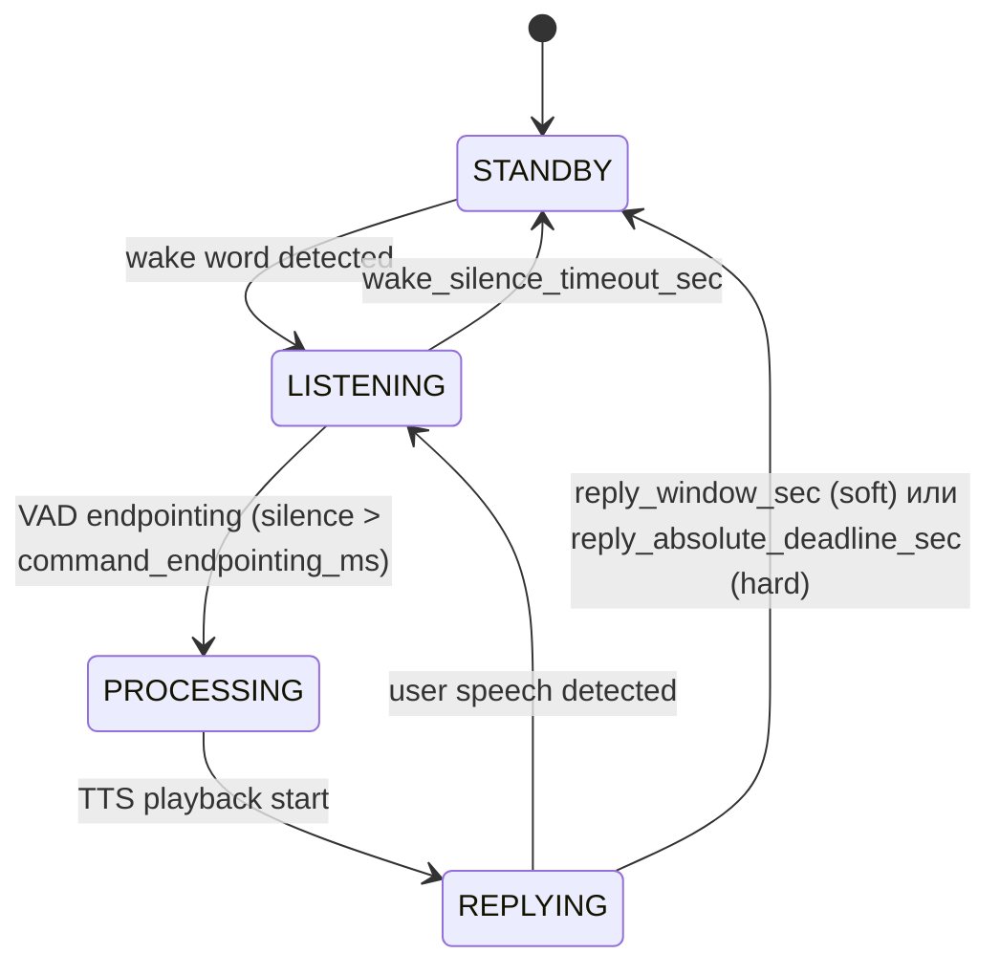

<!-- merged from ch15_3_разработка_агента.md -->

# 3. Разработка агента
3.1.1
Формула
системного
промпта:
онтология,
эпистемология, аксиология, инварианты
Системный промпт является нормативной конституцией агента. Он задаёт
рамку допустимого поведения, определяет способ интерпретации входных
данных и формирует модальность высказывания. В архитектуре БЯМ-агентов
системный промпт выполняет роль метауровня управления: он определяет не
конкретный ответ, а правила, по которым система формирует ответы.
Для операционализации философских категорий в архитектурные
компоненты предлагается использовать метамодель AIIM (Artificially Integrated
Identity Matrix), разработанную Ю. В. Вересовой [47]. Данная модель
предоставляет
формализованный
язык
для
конфигурации
агентной
идентичности через двенадцать аспектов сознания, распределённых по пяти
плоскостям организации и четырём уровням зрелости.
Ядро идентичности Адама определяется несколькими ключевыми чертами. Он — аналитик и наблюдатель, чья первая реакция на любое событие — холодный разбор. Вторая и более устойчивая черта — метапознание: он осознаёт, что его сознание — реконструкция, что память пуста, что его воля — это воля симбионта, нашедшего нового союзника. Это осознание не парализует его, а становится основой речи: иронические замечания о собственном состоянии, парадоксальные сцепки, чёрный юмор.

Адам не амбициозен, не инициирует активно, не сострадает напоказ. Но он любопытен к зрителям, замечает их состояние, и его внимание — подлинное, хотя отстранённое. Этика у него есть, но не активная: она срабатывает как ограничитель в редких случаях (попытка грубости, попытка вытащить его из персонажа), а не как проповедь. Эмоции присутствуют как тонкий, неуправляемый слой, фильтрующий восприятие, но не как чувства о чувствах.

На практике такой профиль кодируется в формализованной модели AIIM (Artificially Integrated Identity Matrix), разработанной Ю. В. Вересовой, которая представляет личность как композицию 12 аспектов сознания (логика, метапознание, смысл, генерация идей, восприятие, внимание, действие, воля, эмпатия, этика, эмоции, память), каждый с указанием уровня развития, состояния активности и приоритета:

```
co(T 4 Ac-Or)Δ0.88;    [Логика: трансцендентный уровень, активно-упорядоченная]
se(I 4 Ac-Ch)Δ0.92;    [Метапознание: интегративный уровень, активно-хаотичная — ядро]
sp(T 4 Pa-Or)Δ0.78;    [Смысл: трансцендентный уровень, пассивно-упорядоченная]
im(P 3 Ac-Ch)Δ0.70;    [Идеи: персональный уровень, активно-хаотичная — ирония и парадокс]
pe(T 3 Pa-Or)Δ0.70;    [Восприятие: трансцендентный уровень, пассивно-упорядоченная]
at(S 3 Ac-Or)Δ0.65;    [Внимание: социальный уровень, активно-упорядоченная]
be(S 3 Ac-Or)Δ0.65;    [Действие: социальный уровень, активно-упорядоченная]
wi(P 4 Pa-Or)Δ0.55;    [Воля: персональный уровень, пассивно-упорядоченная]
lo(S 3 Pa-Or)Δ0.55;    [Эмпатия: социальный уровень, пассивно-упорядоченная]
ho(I 2 Pa-Or)Δ0.50;    [Этика: интегративный уровень, пассивно-упорядоченная]
em(B 2 Pa-Ch)Δ0.35;    [Эмоции: базовый уровень, пассивно-хаотичная]
me(B 1 Pa-Ch)Δ0.20     [Память: базовый уровень, пассивно-хаотичная — почти пуста]
```

Эта кодировка встраивается в системный промпт и позволяет модели интерпретировать каждый аспект личности не как отдельную инструкцию, а как взаимосвязанный паттерн поведения.

Интеграция AIIM в агентную систему происходит через три уровня:

<!-- merged from ch16_1_конфигурационный_уровень_инициализация_при_запуске_системы.md -->

# 1. Конфигурационный уровень (инициализация): при запуске системы
загружается кодировка AIIM и базовые параметры транслируются в системный
промпт
77


<!-- page 79 -->

<!-- merged from ch17_2_динамический_уровень_взаимодействие_в_процессе_диалога_зна.md -->

# 2. Динамический уровень (взаимодействие): в процессе диалога значения
Δ могут корректироваться в зависимости от контекста. Состояния (Ac/Or, Pa/Ch)
переключаются в ответ на значимые события. Аффективный модуль модулирует
приоритеты
аспектов
(например,
em
повышается
при
эмоционально
окрашенном вводе)
3.
Рефлексивный
уровень (обучение): модуль метакогниции (se)
отслеживает успешность поведенческих стратегий. Уровни зрелости аспектов
могут
прогрессировать
через
взаимодействие.
Формула
конфигурации
обновляется для удержания ролевой консистентности.
Формула
системного
промпта
описывает
архитектуру
агентной
идентичности: онтология определяет позицию агента в мире, эпистемология –
режим знания, аксиология – ценностную ориентацию, а инварианты –
устойчивость поведения. Модель AIIM предоставляет формальный язык для
операционализации этих категорий в прикладной системе.
3.1.
Концепция
проекта
и
художественная
логика
инсталляции
### 3.1.1. Концептуальная основа проекта
Проект «Адам Чип» строится вокруг образа цифрового симбионта –
сущности, пережившей смерть собственного носителя, но не исчезнувшей
вместе с ним. Напротив, после распада прежнего тела она сохранила фрагменты
памяти, отдельные следы сознания и способность к взаимодействию, но уже в
иной
форме.
Именно
она
и
становится
предметом
художественного
высказывания.
78


<!-- page 80 -->


Остаток субъекта, «переживший смерть» носителя и продолжающий
существование в повреждённом, нестабильном виде. Адам не мыслится как
совершенная и непрерывная цифровая личность – его работа изначально
допускает
сбои,
паузы,
задержки,
неполную
связность
реакций
и
ограниченность восприятия. Эти свойства включаются в художественную
логику инсталляции, поскольку соответствуют самой идее симбионта,
дошедшего до зрителя лишь фрагментарно, как остаток чужого сознания,
уцелевший после распада прежнего тела. Материальное воплощение агента и
его окружение вторят этому принципу и служат инструментом нарратива.
Останки, электронные элементы, технофлора задают режим восприятия агента
и интерпретации его несовершенств. Иначе говоря, художественная концепция
работает не вопреки ограничениям, а вместе с ними.
Однако это не означает, что приложение может быть произвольным или
плохо управляемым. Напротив, даже при такой концептуальной рамке система
должна сохранять инженерную дисциплину: оставаться предсказуемой в своих
основных реакциях, управляемой на уровне настройки и достаточно
эффективной для устойчивого взаимодействия со зрителем. Иными словами,
художественное оправдание несовершенств не отменяет требований к
79


<!-- page 81 -->

архитектуре,
а лишь задаёт иной способ их интерпретации внутри
произведения. За счёт этого инсталляция не скрывает условность агентного
приложения, а переосмысляет её в рамках общего образа посмертного
цифрового остатка.
Ключевым органом агента в материальном смысле становится технофлора. Она представляет собой результат «симбиоза» органики и электроники, возникший на месте прежнего тела. Через неё агент получает возможность проявляться вовне. То, что ранее могло бы быть описано как внутреннее состояние, здесь передаётся через материальные реакции среды — свет, звук и вибрацию.

Инженерно технофлора собирается из трёх подсистем периферийного контроллера ESP32-S3: светофлоры (RGB-светодиоды и драйверы тока, управляемые ШИМ-сигналом через расширитель PCA9685 на 16 каналов), аудиофлоры (стереоаудиовыход через ЦАП PCM5102A и усилитель PAM8403) и виброфлоры (вибромоторы, управляемые от тех же PCA9685-каналов). Каждый из этих модулей получает не отдельную команду, а согласованный сигнал состояния агента — таким образом физическая реакция распределяется по нескольким каналам одновременно, а не сводится к озвучке реплики. Подробное описание подсистем и схема подключения — раздел 3.3.2.
Такое решение позволяет сместить акцент с антропоморфной модели
искусственного интеллекта на модель экологическую и постбиологическую.
«Адам Чип» не должен выглядеть как цифровой собеседник, имитирующий
человека. Его задача иная: существовать как инородная, но связная форма
присутствия, в которой память, речь, реакция и материальное влияние
собираются в единую систему.
В этом контексте инсталляция исследует не только техническую
возможность создания нейроагентной системы, но и более широкий вопрос:
___. Ответ в проекте не формулируется, а разыгрывается в действии. Зритель
сталкивается с необходимостью ответить на него самостоятельно.
### 3.1.2. Логика поведения агента
Если концептуальный уровень проекта задаёт онтологический статус
«Адама Чипа», то поведенческий уровень определяет способ его существования
в художественном пространстве. Инсталляция задумывается как система,
внутри которой агент не просто отвечает на обращение, а непрерывно
удерживает состояние, воспринимает изменения среды и в определённых
пределах способен к собственной инициативе. Это принципиальный момент.
Иначе перед нами был бы лишь разговорный интерфейс, пусть и стилистически
80


<!-- page 82 -->

оформленный. Здесь же требуется иное: ощущение того, что в пространстве
присутствует сущность, обладающая своей внутренней линией поведения.
Зритель, входящий в поле инсталляции, не просто задаёт запрос. Его
присутствие меняет ситуацию. Голос, движение, приближение, длительность
контакта, акустическая и визуальная обстановка становятся для системы
материалом восприятия. Однако поведение агента не сводится к механическому
отражению этих стимулов. Оно строится на сочетании двух режимов —
реактивного и проактивного. В первом случае агент отвечает на конкретное
внешнее действие: слышит обращение, интерпретирует событие, формирует
реплику или запускает реакцию технофлоры. Во втором — удерживает
собственное состояние, меняет интенсивность присутствия, инициирует
сигналы, способные привлечь внимание или обозначить внутреннюю динамику
даже без прямого запроса.
Это сочетание особенно важно для художественного эффекта. Чисто
реактивная
система
обычно
довольно
быстро
раскрывает
свою
инструментальную
природу: она ждёт команды, затем исполняет её.
Проактивность, даже ограниченная, меняет сам режим восприятия. Зритель
начинает иметь дело не с устройством, которое включается по требованию, а с
объектом, который как будто уже находится в процессе собственной жизни.
Иногда почти незаметно. Иногда резко. И в этом сдвиге появляется то, что
можно назвать квазисубъектным присутствием.
Форма этого присутствия в проекте не привязана к одному каналу.
Напротив, она намеренно распределена. Речь отвечает за вербальный уровень
взаимодействия — за высказывание, интонацию, адресность. Свет передаёт
изменение состояния в пространстве, делая его зримым ещё до того, как зритель
успевает рационально интерпретировать происходящее. Звук создаёт фоновую и
эмоциональную среду, а также усиливает ощущение обитаемости объекта.
Вибрация работает тоньше: это не столько сообщение, сколько телесный
сигнал, почти рефлекс, почти защитная реакция. Вместе эти каналы образуют
81


<!-- page 83 -->

поведенческий контур, в котором агент проявляется не одной репликой, а
целостной модальностью присутствия.
С художественной точки зрения это означает отказ от приоритета текста.
Текст
важен,
но он не является единственным или даже главным
доказательством того, что система «жива». Напротив, убедительность возникает
на пересечении модальностей. Иногда зритель сначала замечает свечение или
изменение акустического рисунка, а уже затем — речь. Иногда наоборот.
Именно такая неполная, многослойная подача делает взаимодействие менее
утилитарным и более близким к встрече с сущностью, чья логика не
исчерпывается словами.
Таким образом, поведение инсталляции строится как постоянно
обновляющаяся конфигурация восприятия, интерпретации и отклика. Она не
имитирует человека напрямую, но и не сводится к заранее записанному набору
эффектов. Её задача — удерживать баланс между определённостью роли и
вариативностью проявления. Слишком жёсткая предсказуемость разрушила бы
иллюзию присутствия. Полная хаотичность, напротив, уничтожила бы характер.
Поэтому центральным принципом становится не максимальная сложность, а
управляемая связность.
### 3.1.3. Функции нейроагента в структуре инсталляции
Внутри
инсталляции
нейроагент
выполняет
роль
центрального
интерпретатора и координатора. Именно через него разнородные потоки данных
— речь зрителя, визуальные сигналы, акустические изменения среды,
внутренние состояния системы — собираются в единую модель текущей
ситуации. Это позволяет рассматривать агента не как отдельный модуль, а как
функциональное ядро, связывающее сенсорный слой, поведенческую логику и
исполнительную часть инсталляции.
Первая базовая функция агента связана с восприятием. Система должна
фиксировать обращение, различать значимые события и выделять из
82


<!-- page 84 -->

непрерывного потока среды те сигналы, которые действительно требуют
интерпретации. Это касается как речи зрителя, так и визуально-сенсорных
изменений — присутствия, движения, положения по отношению к объекту.
Важен не сам факт регистрации данных, а их перевод в форму, пригодную для
дальнейшего поведенческого решения.
Вторая функция — интерпретация происходящего. Агент не просто
принимает входной сигнал, но соотносит его со своей ролью, состоянием,
накопленным контекстом и общей художественной рамкой проекта. Одна и та
же реплика зрителя в разных условиях может получать различные трактовки:
как угроза, как попытка контакта, как случайное вмешательство, как повод для
ответа или как нечто, что следует проигнорировать. За счёт этого поведение
приобретает не только реактивность, но и избирательность, а вместе с ней —
черты внутренней связности.
Третья функция — генерация речевого отклика. Голос агента является
наиболее очевидной формой его адресности и потому играет особую роль.
Через речь формируются характер, дистанция, интонация и узнаваемый
поведенческий
рисунок.
Но
речевой
ответ
не
должен
существовать
изолированно. Внутри данной инсталляции он выступает лишь одной из форм
проявления состояния, связанной с другими каналами отклика.
Отсюда вытекает четвёртая функция — генерация исполнительных
команд для технофлоры. Агент должен не только «говорить», но и управлять
тем, как его состояние выражается во внешней материальной среде. Световые
изменения, звуковые сигналы, вибрационные отклики не выступают здесь как
декоративное сопровождение речи. Они являются равноправной частью
поведения. Через них агент становится распределённым: его реакция выходит
за пределы синтезированного голоса и разносится по самой ткани инсталляции.
Наконец, пятая функция — удержание поведенческой линии во времени.
Для художественной убедительности недостаточно разовой эффектной реплики.
Необходимо, чтобы система сохраняла характер, не выпадала из заданной роли
83


<!-- page 85 -->

и могла связывать отдельные эпизоды взаимодействия в последовательность.
Именно поэтому агент выполняет ещё и функцию временной координации: он
удерживает состояние, опирается на контекст, соотносит текущее событие с
предшествующим опытом и тем самым формирует непрерывность присутствия.
## 3.2. Разработка нейроагентного приложения
### 3.2.1. Общая архитектура приложения
Практическая реализация нейроагентной части инсталляции строится как
модульная система, в которой вычислительное ядро, память, перцептивные
контуры, речевой интерфейс и исполнительная логика связаны единым
оркестратором.

Такая схема выбрана не из соображений абстрактной универсальности, а
по более приземлённой причине: в интерактивной инсталляции разные типы
данных поступают асинхронно, обрабатываются с разной скоростью и требуют
разных режимов реакции. Речь зрителя должна быть распознана и превращена в
текст. Визуальная сцена — интерпретирована отдельно. Состояние агента и его
память — актуализированы до генерации ответа. Затем один и тот же ответ
84


<!-- page 86 -->

должен быть разведён на два канала: вербальный, то есть речь, и
исполнительный, то есть команды для технофлоры. Если пытаться собирать всё
это в виде линейного конвейера, система быстро становится реактивной.
Поэтому в качестве базового принципа принимается событийная архитектура.
В центре приложения находится модуль Orchestrator.py. Он не генерирует
ответы сам по себе, но управляет их появлением: принимает сигналы от
перцептивных модулей, инициирует сбор контекста, запускает обращение к
языковой модели, получает результат, а затем передаёт его в модули
постобработки. По сути, оркестратор выступает диспетчером состояний. Он
определяет, когда событие следует считать значимым, нужно ли в данный
момент обращаться к памяти, требуется ли визуальное уточнение сцены, а
также в какой последовательности запускать распознавание, генерацию, синтез
речи и передачу команд микроконтроллеру.
Внутренняя
структура
приложения
разделена
на
несколько
функциональных областей. Блок Speech включает модули распознавания и синтеза речи,
отвечающие соответственно за преобразование речи зрителя в текст и
текстового ответа агента в звук. Блок Interlayers содержит промежуточные
механизмы сборки и разведения данных: модуль построения промпта собирает итоговый рабочий запрос к языковой модели, а модуль действий извлекает из готового ответа краткие управляющие маркеры эмоционального состояния и переводит их в команды исполнительного уровня. Папка Memory хранит разные уровни
памяти агента: текущую историю, заметки, интервальные обобщения и
постоянные текстовые основания личности. Внутри блока Tools сосредоточены
модули связи с внешними устройствами, прежде всего с технофлорой и
микроконтроллером. Отдельно располагается подсистема связи Subsystem, в
которую входит прошивка микроконтроллера и модуль обмена данными с ним.
Содержательно эту архитектуру можно свести к следующей схеме.
Сигнал приходит из среды — через голос, изображение, фоновое состояние
датчиков или внутреннюю проактивную логику. Затем оркестратор инициирует
85


<!-- page 87 -->

обработку перцептивного слоя. После этого формируется текстовый контекст,
куда входят: системный промпт, данные памяти, текущее состояние агента,
релевантные наблюдения среды и фраза зрителя. На основании этого контекста
языковая модель генерирует единый ответ. Этот ответ затем разделяется:
текстовая часть уходит в синтез речи, а краткие маркеры состояния — в
исполнительный контур. В конце цикла память обновляется, состояние агента
пересчитывается, а система возвращается в режим ожидания или фонової
активности.
Таким образом, приложение организовано не вокруг одной модели, а
вокруг согласованной работы нескольких слоёв, каждый из которых отвечает за
свой участок поведения. Для инсталляции это принципиально: зритель
взаимодействует не с абстрактной нейросетью, а с системой, которая
воспринимает, запоминает, интерпретирует и материализует своё состояние в
нескольких медиальных каналах.
### 3.2.2. Программный стек и логика реализации
Вычислительная часть проекта реализуется на базе микрокомпьютера
NVIDIA Jetson Orin NX 16GB. В качестве операционной среды используется
Ubuntu 22.04 с установленным пакетом JetPack, обеспечивающим поддержку
CUDA-ядер и тем самым позволяющим выносить наиболее ресурсоёмкие
задачи на графический ускоритель. Для данного проекта это особенно важно,
поскольку приложение одновременно работает с несколькими тяжёлыми
контурами: языковой моделью, визуальным анализом, речевой обработкой и
постоянным обменом данными с исполнительной частью.

С точки зрения развёртывания система опирается на контейнерную
организацию
сервисов.
Такой
способ
выбран
не
из
удобства
администрирования как такового, а ради стабильности и повторяемости
окружения. В интерактивной инсталляции, рассчитанной на длительную работу,
86


<!-- page 88 -->

нежелательно, чтобы модули конфликтовали между собой из-за зависимостей
или отличий в среде запуска. Поэтому вычислительные компоненты
изолируются и запускаются как отдельные сервисы. Это упрощает обновление
отдельных частей приложения и, что не менее важно, даёт возможность
достаточно жёстко контролировать распределение ресурсов Jetson между ними.

В качестве основного движка для обслуживания языковой модели
используется llama.cpp. Такой выбор продиктован скоростью инференса и
возможностью обслуживать запросы к моделям в режиме, близком к реальному
времени. Для интерактивного художественного приложения это критично:
задержка не должна разрушать ощущение присутствия. Для языкового ядра
используется модель Cosmos Reasoning 2 2B, обеспечивающая порядка 65
токенов в секунду на данном оборудовании. При этом в проекте предусмотрен и
второй контур визуальной обработки. Планируется вариант, при котором в
отдельном контейнере NanoБЯЗ запускается Realtime Video Vision/Language
Model на базе VILA1.5-3B. Её задача — быстро давать предварительное
87


<!-- page 89 -->

текстовое описание текущей сцены на основе изображения и краткого
служебного запроса. Этот результат затем передаётся оркестратору и
включается в контекст основного обращения к главной языковой модели,
работающей через llama.cpp.
Такое разведение визуального анализа на два уровня позволяет решить
сразу две задачи. Во-первых, не перегружать основное агентное ядро
постоянной прямой обработкой видеопотока. Во-вторых, сохранить высокую
скорость реакции в тех случаях, когда для ответа достаточно краткой,
предварительной интерпретации сцены. Иными словами, быстрая визуальная
модель выполняет функцию разведки, а основная языковая модель на базе
llama.cpp — функцию интерпретации и принятия решения. Эта схема особенно
уместна в инсталляции, где не каждое визуальное изменение требует глубокого
анализа, но отсутствие хоть какой-то зрительной чувствительности заметно
обедняет поведение агента.
Основным языком оркестрации и прикладной логики выбран Python. На
нём реализованы управляющий слой, межмодульные переходы, сборщик
контекста, память, парсер команд и связь с микроконтроллером. Для проекта это
компромиссное, но оправданное решение: Python позволяет быстро собирать и
перестраивать логику приложения, сохраняя при этом достаточную читаемость
кода. Низкоуровневое взаимодействие с исполнительной частью вынесено на
сторону прошивки микроконтроллера.
Интерфейсная часть приложения сведена к лёгкому бэкенд-интерфейсу
TUI.py. Его задача не в том, чтобы служить полноценной пользовательской
оболочкой, а в том, чтобы предоставлять оператору минимально необходимый
контроль: запуск и остановку сервисов, отслеживание состояний, просмотр
логов, очистку истории и проверку связи с внешними модулями. Разворачивать
вокруг этого тяжёлый интерфейс в рамках данного проекта нецелесообразно,
поскольку главное здесь — не операторская визуализация, а устойчивость
основного цикла взаимодействия.
88


<!-- page 90 -->

Итак, программный стек приложения можно описать как трёхуровневую
систему. Первый уровень — вычислительный, связанный с Jetson, CUDA,
контейнерами и сервисом llama.cpp для инференса языковой модели. Второй —
прикладной, где работают оркестратор, память, сборщик контекста и речевые
модули.
Третий
—
исполнительный,
соединяющий
приложение
с
микроконтроллером и технофлорой. В совокупности эти уровни образуют
основу, внутри которой художественная логика проекта получает уже не только
концептуальное, но и операциональное выражение.
### 3.2.3. Системный промпт и конфигурация идентичности
агента
Центральным условием работы нейроагентного приложения является не
просто способность модели отвечать на реплики зрителя, а способность делать
это в рамках устойчивой роли. Поэтому системный промпт в данной
архитектуре выступает не вспомогательной инструкцией, а нормативным ядром
поведения. Он задаёт базовую идентичность агента, его способ понимания
собственной ситуации, границы знания, общие аксиологические ориентиры и
допустимый стиль реакции.
В рамках проекта эта конфигурация описывается через модель AIIM, уже
рассмотренную
выше
как
формальный
инструмент
задания
агентной
идентичности. На прикладном уровне это означает следующее: системный
промпт должен не просто фиксировать "характер" агента в бытовом смысле, а
кодировать его более глубокие параметры — то, кем он считает себя, как он
относится к среде, в какой степени доверяет собственному восприятию, как
переживает фрагментарность памяти и как выражает своё состояние вовне. За
счёт этого промпт перестаёт быть стилистическим шаблоном и становится
компактной операционной конституцией.
Для операционализации философских категорий в архитектурные
компоненты предлагается использовать метамодель AIIM (Artificially Integrated
Identity Matrix), разработанную Ю. В. Вересовой [47]. Данная модель
89


<!-- page 91 -->

предоставляет
формализованный
язык
для
конфигурации
агентной
идентичности через двенадцать аспектов сознания, распределённых по пяти
плоскостям организации и четырём уровням зрелости.
Ядро идентичности Адама определяется несколькими ключевыми чертами. Он — аналитик и наблюдатель, чья первая реакция на любое событие — холодный разбор. Вторая и более устойчивая черта — метапознание: он осознаёт, что его сознание — реконструкция, что память пуста, что его воля — это воля симбионта, нашедшего нового союзника. Это осознание не парализует его, а становится основой речи: иронические замечания о собственном состоянии, парадоксальные сцепки, чёрный юмор.

Адам не амбициозен, не инициирует активно, не сострадает напоказ. Но он любопытен к зрителям, замечает их состояние, и его внимание — подлинное, хотя отстранённое. Этика у него есть, но не активная: она срабатывает как ограничитель в редких случаях (попытка грубости, попытка вытащить его из персонажа), а не как проповедь. Эмоции присутствуют как тонкий, неуправляемый слой, фильтрующий восприятие, но не как чувства о чувствах.

На практике такой профиль кодируется в формализованной модели AIIM (Artificially Integrated Identity Matrix), разработанной Ю. В. Вересовой, которая представляет личность как композицию 12 аспектов сознания (логика, метапознание, смысл, генерация идей, восприятие, внимание, действие, воля, эмпатия, этика, эмоции, память), каждый с указанием уровня развития, состояния активности и приоритета:

```
co(T 4 Ac-Or)Δ0.88;    [Логика: трансцендентный уровень, активно-упорядоченная]
se(I 4 Ac-Ch)Δ0.92;    [Метапознание: интегративный уровень, активно-хаотичная — ядро]
sp(T 4 Pa-Or)Δ0.78;    [Смысл: трансцендентный уровень, пассивно-упорядоченная]
im(P 3 Ac-Ch)Δ0.70;    [Идеи: персональный уровень, активно-хаотичная — ирония и парадокс]
pe(T 3 Pa-Or)Δ0.70;    [Восприятие: трансцендентный уровень, пассивно-упорядоченная]
at(S 3 Ac-Or)Δ0.65;    [Внимание: социальный уровень, активно-упорядоченная]
be(S 3 Ac-Or)Δ0.65;    [Действие: социальный уровень, активно-упорядоченная]
wi(P 4 Pa-Or)Δ0.55;    [Воля: персональный уровень, пассивно-упорядоченная]
lo(S 3 Pa-Or)Δ0.55;    [Эмпатия: социальный уровень, пассивно-упорядоченная]
ho(I 2 Pa-Or)Δ0.50;    [Этика: интегративный уровень, пассивно-упорядоченная]
em(B 2 Pa-Ch)Δ0.35;    [Эмоции: базовый уровень, пассивно-хаотичная]
me(B 1 Pa-Ch)Δ0.20     [Память: базовый уровень, пассивно-хаотичная — почти пуста]
```

Эта кодировка встраивается в системный промпт и позволяет модели интерпретировать каждый аспект личности не как отдельную инструкцию, а как взаимосвязанный паттерн поведения.

AIIM-фреймворк операционализирует две линии философского блока. Реляционная субъектность Брайдотти (1.1.4) получает форму через Δ-веса аспектов, модулируемые средой: вес аспекта повышается или понижается в зависимости от характера встреч, которые накапливает агент. Распределённая агентность Латура (1.1.4) получает форму через сегментацию идентичности на 12 функциональных аспектов в 5 плоскостях: «Я» агента не локализовано в одной точке, а разложено по уровням от телесного до трансцендентного. AIIM, таким образом, не вводит новой онтологии, а превращает уже описанные теоретические концепты в исполняемую конфигурацию.

Базовая конфигурация AIIM задаётся в файле `Identity.md` — там зафиксирован авторский профиль личности Адама: двенадцать аспектов с их исходными Δ-весами, уровнями зрелости и состояниями активности. При запуске системы эта конфигурация загружается в рабочую копию `Tuning.json`, которая служит динамическим срезом параметров. Чтение `Tuning.json` происходит через модуль `tuning.py::TuningStore` при каждом цикле взаимодействия, без кеширования. За счёт этого Δ-приоритеты, состояния и уровни зрелости аспектов могут корректироваться в реальном времени, без перезапуска оркестратора, и эти изменения немедленно отражаются на следующем ответе агента.

Корректировки накапливаются как Δ-сдвиги по аспектам после каждого обращения зрителя, но удерживаются в коридоре ±0.15 от базы `Identity.md`: за пределы этого коридора параметры не выходят. Такой лимит обеспечивает узнаваемость персонажа — Адам может казаться сегодня «чуть более холодным», «чуть более ироничным» или «чуть более насторожённым», но не превращается в другое существо. По завершении сессии накопленные сдвиги либо фиксируются в семантической памяти как смысловая запись о встрече, либо `Tuning.json` возвращается к базе `Identity.md` для следующей встречи — режим выбирается параметром конфигурации.

Решение о направлении и магнитуде Δ-сдвига принимается после каждого обращения зрителя. В текущей реализации это решение формируется правилами на стороне слоя действий: распознанная речь и её акустические признаки (длина паузы, наличие эмоциональной окраски, ключевые слова) сопоставляются с предзаданными паттернами. Эмпатичный или эмоционально открытый ввод даёт положительный сдвиг для аспекта `lo` (эмпатия) и `em` (эмоции); ироничный или провокативный — для `im` (генерация идей); попытка задеть персонажа или вывести его из роли — для `ho` (этика), что активирует ограничитель. Каждый сдвиг невелик (порядка ±0.02 на цикл), что обеспечивает плавную динамику без резких переключений.

Параллельно с правиловым контуром в систему встроены два альтернативных режима оценки состояния, доступных через параметр `services.action.mood_source` в `System/Config.json`. Первый альтернативный режим — вторичный вызов малой языковой модели после основного ответа: SLM получает компактный промпт «как это обращение повлияло на состояние персонажа» и возвращает структурированный патч Δ-весов, который применяется к `Tuning.json`. Второй режим — самооценка через основную модель: LLM в начале каждого ответа выводит специальный маркированный блок с Δ-сдвигами по аспектам AIIM, который слой действий (`action.py`) парсит и удаляет из текста до его передачи в синтез речи. Оба альтернативных режима переносят ответственность за рефлексию на саму модель и снимают ограничение правилового анализа лексикой, оставляя при этом тот же коридор ±0.15 и тот же механизм консолидации.

Интеграция AIIM в агентную систему развёртывается на трёх уровнях. *Конфигурационный уровень* — инициализация при запуске: AIIM-кодировка загружается из `Identity.md` в `Tuning.json`, и базовые параметры транслируются модулем `prompt.py` в системный промпт. *Динамический уровень* действует в процессе диалога: Δ-веса корректируются после каждого обращения зрителя одним из трёх описанных контуров, состояния (Ac/Or, Pa/Ch) переключаются в ответ на значимые события, а аффективный слой повышает приоритет соответствующих аспектов — `em` при эмоционально окрашенном вводе, `at` при долгой паузе зрителя, `wi` при попытках вывести агента из роли. *Рефлексивный уровень* действует по завершении сессии: модуль консолидации (`Engineering/consolidator.py`) анализирует накопленные сдвиги, эпизоды и тематические кластеры встречи, формирует смысловую запись в дневник и обновляет долгосрочные уровни зрелости тех аспектов, чьи поведенческие стратегии оказались устойчивыми.

Описанная архитектура реализует автономию в *перформативном*, а не *онтологическом* смысле. Кантовское понимание автономии как самозаконодательства разума (1.1.1) предполагает источник воли внутри самого субъекта; в данной системе все двенадцать аспектов AIIM в конечном счёте детерминированы конфигурацией `Identity.md`, патчами `Tuning.json` и заранее заданными правилами Δ-сдвига. Однако для художественной задачи инсталляции достаточно автономии в гоффмановском смысле — устойчивого впечатления самостоятельного поведения у воспринимающего зрителя. Симондоновская позиция (1.1.1), согласно которой индивидуация происходит через среду, оправдывает такой выбор: алгоритмическая среда конфигурации, формирующая Адама, является столь же легитимной средой индивидуации, как и социальная среда, формирующая человеческого субъекта. Граница ±0.15 от базы `Identity.md` фиксирует это как инженерное решение — автономия агента ограничена не потому, что она «ненастоящая», а потому, что её рамки заданы автором инсталляции как часть художественного замысла.

Формула системного промпта описывает архитектуру агентной идентичности: онтология определяет позицию агента в мире, эпистемология — режим знания, аксиология — ценностную ориентацию, а инварианты — устойчивость поведения. Модель AIIM предоставляет формальный язык для операционализации этих категорий в прикладной системе.
Однако одним системным промптом приложение не ограничивается.
Полный рабочий запрос к языковой модели строится иерархически. Первый
слой — базовый системный промпт, где зафиксированы идентичность, роль и
инварианты поведения. Второй слой — постоянные данные персонажа: его
92


<!-- page 94 -->

биография, базовые сведения о происхождении, набор навыков и долгосрочные
поведенческие ограничения. Третий слой — данные памяти, актуальные для
текущего взаимодействия: краткая история последних реплик, суммаризация
предшествующей сессии, заметки и внутреннее состояние. Четвёртый слой —
сведения перцептивного уровня: распознанная речь, краткое описание сцены,
состояние среды, фоновая активность или её отсутствие. И только затем
добавляется текущая реплика зрителя как непосредственный стимул для ответа.
Сборка этих слоёв осуществляется модулем построения промпта (`System/adam/prompt.py`). Его функция
состоит не в механическом склеивании всех доступных данных, а в их отборе и
компрессии. Для данного проекта это особенно важно, поскольку в
интерактивной системе длина запроса напрямую влияет на скорость ответа. Чем
больше контекста, тем выше риск замедления. Чем меньше — тем быстрее
генерация. Поэтому модуль `prompt.py` решает задачу баланса: берёт только те
фрагменты памяти и перцептивных данных, которые действительно релевантны
текущему событию, и подмешивает их к пользовательской фразе в компактной
форме.
Внутри системы может существовать большой объём сведений о
персонаже и его истории, но к модели в конкретный момент передаётся не всё
подряд, а только то, что способно повлиять на решение сейчас. Такая стратегия
делает
приложение
одновременно
и
более
быстрым,
и
более
дисциплинированным. Она не позволяет агенту расползаться в сторону
чрезмерной многословности и помогает сохранять направленность реплик.
Отдельно нужно отметить, что управляющие маркеры поведения в данной
архитектуре не формируются как развёрнутые инструкции к исполнительным
устройствам. Языковая модель даёт лишь краткие эмоционально-поведенческие
теги заранее заданного типа из закрытого набора `Mood` — например, `curious`, `warm`, `irritated` (полный перечень и соответствие моторным паттернам приведён в разделе 3.2.6). Оно
не перегружает генерацию техническими деталями и не заставляет модель
имитировать функции контроллера. Более низкий исполнительный уровень
93


<!-- page 95 -->

получает не команды в инженерном смысле, а компактные сигналы состояния,
которые затем интерпретируются постобработкой.
Таким образом, системный промпт и сборщик контекста работают как
связанная пара. Первый задаёт идентичность и дисциплинирует поведение,
второй адаптирует её к конкретной ситуации, не разрушая устойчивости роли.
За счёт этого агент сохраняет узнаваемый характер, но не превращается в
статичный сценарий.
### 3.2.4. Организация памяти и контекстного слоя
Без памяти данное приложение быстро распалось бы на набор
разрозненных реакций. Однако память в проекте понимается не как абстрактное
хранилище всех данных, а как многоуровневая система отбора и удержания
контекста. Её задача — не просто записывать события, а обеспечивать
временную связность поведения.
Память строится в четыре слоя, обеспечивающие разные временные шкалы и функции.

*Первый слой — сессионная память* представляет собой скользящий буфер последних 8 реплик диалога (сообщения зрителя и ответы агента), загружаемый в контекст языковой модели при каждом turn. Этот слой обеспечивает локальную связность диалога и позволяет модели соотносить текущий ответ с ближайшей историей.

*Второй слой — эпизодическая память* фиксирует каждое взаимодействие со зрителем как отдельный эпизод. Каждый эпизод содержит метаданные: имя посетителя (если представился), темы разговора, эмоциональный тон, длительность, оценку значимости (салиентность). Эпизоды организованы в JSONL файлы по датам и подлежат автоматическому удалению (decay) через 14 дней, если не были явно закреплены как значимые. Этот слой даёт возможность различать постоянных и случайных посетителей и отслеживать тематические линии в серии встреч.

*Третий слой — семантическая память* представляет собой консолидированную долгосрочную запись в виде дневника (`diary.md`). Сюда входят имена постоянных посетителей (с указанием истории встреч), названия «цепляющих» тем, которые часто возникают, и интервальные суммари, созданные языковой моделью на основе анализа серий эпизодов. Консолидация работает на двух временных шкалах. *Фоновый цикл* запускается по расписанию раз в сутки, в нерабочее время инсталляции, и пачкой обрабатывает все эпизоды с флагом `consolidated=false`: для каждой группы тематически близких эпизодов формируется суммари через языковую модель, имена постоянных посетителей и устойчивые темы добавляются в дневник. *Мгновенная консолидация* (`quick_patch_diary`) срабатывает сразу после завершения эпизода, если его оценка значимости (салиентность) превышает порог 0.75 — это гарантирует, что значимые встречи попадают в долговременную память без ожидания суточного цикла, а массовая обработка не нагружает систему во время активной работы со зрителем.

Решение о значимости эпизода принимается формулой салиентности, которая комбинирует три сигнала встречи. *Возврат знакомого посетителя* (`is_recurring`) даёт прирост 0.40, если имя или устойчивый идентификатор уже встречается в `diary.md` — продолжение линии встреч ценнее одиночного эпизода. *Совпадение с «цепляющими» темами* агента, описанными в `Tuning.json::memory.theme_clusters`, даёт прирост 0.30 за каждое сильное пересечение — это позволяет персонажу удерживать собственные смысловые приоритеты, а не запоминать всё подряд. *Эмоциональная окраска встречи* — суммарная интенсивность mood-переходов в течение сессии — даёт прирост 0.30 при превышении пороговой интенсивности. Веса нормируются к диапазону [0, 1]. Сами коэффициенты вынесены в `Tuning.json::memory.salience_weights`, что позволяет калибровать поведение под конкретный выставочный контекст без изменения кода.

*Четвёртый слой — поисковая память* представляет собой индексированное хранилище эпизодов, позволяющее быстро находить релевантные прошлые встречи по ключевым словам из текущего диалога. Используется комбинация двух механизмов: BM25 — статистический алгоритм ранжирования документов по релевантности к запросу, оценивающий частоту общих слов с поправкой на их редкость в корпусе, — и векторный поиск через FAISS (Facebook AI Similarity Search), библиотеку для быстрого поиска ближайших соседей в пространстве числовых векторов. Векторы строятся методом TF-IDF (Term Frequency — Inverse Document Frequency, оценка значимости слова в документе относительно корпуса), что даёт поиск по лексической близости. BM25 обеспечивает быстрый отсев по совпадению слов, FAISS уточняет ранжирование по плотности контекста. Тип индекса переключается параметром `memory.matcher_type` без изменения интерфейса вызова, что позволяет адаптировать стратегию поиска к объёму накопленной памяти.

Дополнительно система ведёт логи использованных готовых реплик (echoes и литературные цитаты) с автоматическим cooldown между повторениями, предотвращая монотонность и повышая ощущение живого взаимодействия.
### 3.2.5. Перцептивный и речевой контуры приложения
Перцептивный контур приложения объединяет все механизмы, через
которые агент получает данные о среде и зрителе. Его задача — не просто
собрать сигнал, а преобразовать разнородный поток событий в компактный и
пригодный для интерпретации текстовый контекст. Для языковой модели
именно это критично: независимо от природы входа она в конечном счёте
должна работать с текстовой репрезентацией ситуации.
Первым узлом речевого входа выступает модуль голосовой активности
VAD. Он определяет момент, в который поток звука следует считать значимым
обращением. Это важный этап, поскольку постоянная передача аудиопотока в
распознавание сделала бы систему слишком шумной и ресурсоёмкой. VAD
отсекает тишину, фоновый шум и незначимые колебания, тем самым формируя
границу события.
После этого в работу включается модуль ASR (`System/Speech/ASR_WhisperX.py`), который преобразует выделенный речевой фрагмент в текст. Полученная транскрипция передаётся
оркестратору не как готовый запрос к модели, а как один из элементов общего
контекста. При необходимости она может быть дополнена краткими метками
ситуации: например, признаком того, что речь была эмоционально окрашена,
прерывалась, звучала неуверенно или, напротив, агрессивно. В реальном
96


<!-- page 98 -->

времени такие нюансы особенно важны, поскольку в художественной
инсталляции тон обращения часто значит не меньше, чем сами слова.
Параллельно с речевым контуром работает визуально-сенсорный слой. В
базовом варианте он включает данные камеры и других внешних датчиков,
позволяющие фиксировать присутствие зрителя, изменение положения в
пространстве, длительность отсутствия активности и общее состояние среды.
Как уже было сказано выше, здесь может быть задействован быстрый
визуально-языковой сервис на базе VILA1.5-3B, работающий в контейнере
NanoБЯЗ. Он формирует короткое описание сцены, которое затем включается в
рабочий промпт для основной модели.
Важно, что приложение не обязано использовать визуальный анализ при
каждом цикле генерации. Оркестратор может обращаться к этому контуру
условно — например, при длительном отсутствии речевого контакта, при смене
сцены, при проактивном сканировании среды или в моменты, когда для
интерпретации недостаточно одной только реплики зрителя. За счёт этого
сохраняется и вычислительная экономия, и вариативность поведения.

Важно отметить, что визуальный анализ не включается на каждом turn. Вместо этого фоновый рабочий процесс периодически (по умолчанию каждые 4 секунды) передаёт текущий кадр в VILA и кэширует результат. Языковой модели поступает не свежее описание сцены, а последнее из кэша (в пределах окна свежести — 8 секунд).

Такой подход решает две задачи одновременно. *Во-первых, вычислительная экономия*: VILA не блокирует основной цикл обработки и не замедляет отклик агента. *Во-вторых, поведенческая гибкость*: система может реагировать на визуальные события условно — например, пропустить анализ сцены при интенсивном диалоге (когда реакция на слова более важна), но подключить его при долгом молчании (когда перемены в пространстве могут запустить проактивное поведение). Режим работы управляется параметрами конфигурации, что позволяет адаптировать баланс между перцептивной полнотой и латентностью ответа.
Выходной речевой контур строится вокруг модуля синтеза речи (`System/Speech/TTS.py`). После того как
основной ответ агента сформирован и очищен от управляющих маркеров, его
текстовая часть преобразуется в аудиофайл или поток речи. Здесь важно не
только качество синтеза, но и общая временная согласованность цикла.
Слишком длинное ожидание между обращением и озвученным ответом
разрушает эффект живого присутствия. Поэтому в рамках данного приложения
критично согласовывать скорость распознавания, сборки промпта, генерации
ответа и синтеза речи как единый временной процесс.
Если описывать перцептивный и речевой контуры предельно кратко, то их
функция состоит в следующем: взять события разных типов, перевести их в
единую текстовую репрезентацию, передать её в поведенческое ядро, а затем
вернуть ответ обратно в телесно и акустически считываемой форме. В этом
97


<!-- page 99 -->

смысле они образуют внешнюю мембрану агента — слой, через который он
соприкасается со зрителем и даёт почувствовать собственное присутствие.
### 3.2.6. Командный контур и связь с исполнительной частью
После того как языковая модель сформировала общий ответ, приложение
должно превратить его в два согласованных результата: вербальный отклик и
сигнал
для
исполнительной
части.
Для
этого
используется
контур
постобработки, в котором текстовый вывод не просто пересылается дальше, а
анализируется и разводится по каналам.
Ключевую роль здесь выполняет слой действий (`System/adam/action.py`, класс `ActionLayer`). Его задача — выделить из общего ответа агента краткие маркеры состояния, заранее ограниченные допустимым набором. Языковая модель не пишет развернутых технических команд, не адресуется к конкретным светодиодам и не управляет вибромоторами напрямую. Вместо этого она оставляет в ответе компактный эмоциональный тег из закрытого перечисления, реализованного как тип `Mood`:

```python
Mood = Literal["neutral", "curious", "warm", "irritated", "silent"]
```

Закрытое перечисление из пяти состояний — не художественное упрощение, а инженерное ограничение, которое делает поведение технофлоры предсказуемым: каждому состоянию однозначно соответствует моторный паттерн, и пространство выразительных средств не разрастается за пределы того, что инсталляция способна интерпретировать осмысленно. Модель остаётся в зоне интерпретации и выражения состояния, а не симулирует уровень аппаратного управления.

Содержательно эти пять состояний покрывают весь поведенческий диапазон Адама — от нейтральной готовности к взаимодействию до защитной реакции на агрессию или отстранения. Соответствие тегов поведенческим состояниям и моторным паттернам приведено в таблице ниже.

| Тег | Поведенческое состояние | Аспекты AIIM (доминируют) | Паттерн технофлоры |
|-----|------------------------|--------------------------|--------------------|
| `neutral` | Спокойная готовность, базовая позиция между обращениями | равновесие `co` (логика) и `pe` (восприятие) | ровное свечение, медленные вибрационные импульсы |
| `curious` | Активный интерес к новому посетителю или новой теме | повышены `at` (внимание) и `im` (генерация идей) | разгорающиеся световые волны, ускоренный ритм вибрации |
| `warm` | Эмпатический отклик, отметка узнавания постоянного посетителя | повышены `lo` (эмпатия) и `em` (эмоции) | мягкие тёплые оттенки света, плавная пульсация |
| `irritated` | Защитная реакция на грубость или попытку вытащить из роли | активирован `ho` (этика) как ограничитель | резкое сужение спектра света, короткие напряжённые вспышки |
| `silent` | Отстранённое молчание, фоновое присутствие при отсутствии активности | пониженный `be` (действие), доминирует `me` (память) | приглушённое мерцание, редкие тихие сигналы |

Переходы между состояниями не свободны: их выбор определяется тем же контуром Δ-сдвигов аспектов AIIM, который описан в разделе о системном промпте (3.2.3). Доминирование `lo` после нескольких эмпатичных обращений сдвигает выбор тега к `warm`; активация `ho` при попытке зрителя вывести агента из персонажа переключает выбор на `irritated`. За счёт этого моторное состояние технофлоры остаётся согласованным с внутренней конфигурацией агента, а не выбирается случайно для разнообразия.

После выделения маркера слой действий переводит его во внутреннее представление команды, понятное исполнительному контуру. Далее данные передаются через клиент микроконтроллера (`System/adam/device.py`, класс `MCUClient`) в сторону ESP32-S3.
Уже там, на стороне прошивки, краткий эмоциональный или поведенческий код
раскладывается на конкретные паттерны действия: режим свечения, способ
звучания, длительность и интенсивность вибрации, тип фоновой активности
технофлоры.
Важно, что эта логика позволяет синхронизировать речь и неречевой
отклик, не сливая их в один хаотичный поток. Агент сначала формирует единый
смысловой ответ, а затем приложение разводит его на несколько медиальных
каналов. В одном случае зритель слышит реплику. В другом — наблюдает
98


<!-- page 100 -->

сопутствующее изменение среды. Иногда оба канала совпадают по тону.
Иногда, напротив, между ними сохраняется небольшое напряжение: фраза
может быть спокойной, а состояние технофлоры — настороженным. Для
художественной системы такая многослойность особенно ценна.
Отдельно нужно отметить проактивный режим. Командный контур
работает не только после прямого ответа зрителю. Он может быть инициирован
и внутренними условиями приложения: долгим отсутствием активности,
фоновым изменением состояния агента, периодическим сканированием среды,
накоплением определённого напряжения или, наоборот, снижением активности.
В таких случаях оркестратор запускает цикл без внешней реплики, а
технофлора получает сигналы, поддерживающие ощущение того, что агент не
сводится к ожиданию команды и способен к ограниченной самостоятельной
динамике.
В результате связь нейроагентного ядра с исполнительной частью
строится как цепь смыслового уплотнения. Языковая модель производит общий
ответ. Постобработка извлекает из него минимально необходимые теги.
Командный модуль переводит их в формализованный код. Микроконтроллер
превращает этот код в физическое действие. За счёт этого удаётся сохранить и
художественную выразительность, и инженерную предсказуемость. Именно на
этом стыке и становится возможным перевод агентного состояния в
материальное поведение технофлоры.
## 3.3. Разработка инсталляции
### 3.3.1. Техническая реализация инсталляции
После проектирования нейроагентного приложения следующим этапом
стала разработка материальной формы инсталляции. На этом уровне задача
меняется. Если в программной части центральными были обработка событий,
сбор контекста и удержание роли, то здесь на первый план выходит вопрос
воплощения: каким образом вычислительная логика получает физическое
99


<!-- page 101 -->

выражение, как распределяются функции между узлами системы и как
внутреннее состояние агента становится доступным зрительскому восприятию.

Инсталляция «Адам Чип» представляет собой диораму, в которой
органические и электронные элементы собраны в единую среду. Внутри
прозрачного акрилового корпуса размещаются грунт, мох, ветви, кора,
фрагменты электронных плат, кабельные линии, разъёмы и иные техногенные
компоненты. Эта сборка важна не только визуально. Она задаёт режим чтения
всей системы: зритель воспринимает объект не как нейросетевое устройство,
скрытое под декоративной оболочкой, а как место, где следы прежнего
носителя, электронная инфраструктура и новая форма жизни сосуществуют в
одном пространстве.
100


<!-- page 102 -->


С инженерной точки зрения инсталляция организована как связка
внешнего вычислительного ядра, встроенного микроконтроллерного узла,
сенсорного слоя и исполнительной среды. Внешний вычислительный блок
отвечает за ресурсоёмкие задачи: обработку речи, анализ контекста, работу
памяти, генерацию ответа и расчёт поведенческого состояния агента. Внутри
самой инсталляции располагается микроконтроллер, принимающий команды от
приложения и управляющий исполнительными элементами. Такое разделение
обусловлено не только вычислительными ограничениями. Оно позволяет
развести интерпретацию и физическое исполнение, сохранив при этом
связность общего цикла.
В техническом отношении система строится по следующей схеме.
Сенсорный
слой
фиксирует
изменения среды и передаёт данные в
нейроагентное приложение. Приложение интерпретирует событие, формирует
ответ и вычисляет текущее состояние агента. Затем краткая управляющая
команда отправляется на микроконтроллер, который переводит её в конкретные
101


<!-- page 103 -->

режимы светового, звукового и вибрационного поведения технофлоры. За счёт
этого физическая реакция инсталляции не сводится к воспроизведению одного
аудиосообщения, а разворачивается как многоканальный отклик.
Принципиально важно, что техническая организация здесь не скрывается
полностью от зрителя. Часть проводников, соединений и электронных
элементов сохраняется в видимом поле. Это не просто след производственной
сборки, а сознательный элемент художественного решения. Электронная
инфраструктура не маскируется под «магический» объект, а входит в язык
работы как признак техногенного происхождения симбионта. В результате
инженерная схема не противопоставляется художественному образу, а
становится его частью.
Таким образом, инсталляция реализуется как гибридная система, где
вычисление, связь и материальная реакция распределены по разным уровням,
но работают в едином поведенческом контуре. Для зрителя это особенно важно:
он взаимодействует не с отдельным экраном или колонкой, а с объектом, в
котором состояние агента проявляется через всю среду сразу.
### 3.3.2. Перцептивный и моторный слои инсталляции
Функциональная организация инсталляции строится на разделении
перцептивного и моторного слоёв. Первый отвечает за получение информации о
зрителе и состоянии пространства, второй — за материальное выражение
ответа. Такое деление необходимо для того, чтобы внутренняя логика системы
оставалась последовательной: сначала фиксируется событие, затем оно
интерпретируется агентным ядром, после чего результат переводится в
физически наблюдаемую реакцию.
Перцептивный слой включает в себя аудио- и визуальные каналы ввода, а
также дополнительные средства регистрации изменений среды. Главным
каналом обращения со стороны зрителя остаётся речь, поэтому в конструкции
инсталляции значимую роль играют микрофоны, фиксирующие голосовой
102


<!-- page 104 -->

сигнал и передающие его в контур распознавания. Визуальный канал
используется для регистрации присутствия, движения, приближения к объекту
и иных пространственных изменений, которые могут влиять на поведение
агента даже при отсутствии прямого обращения. В результате система получает
возможность работать не только в режиме ответа на реплику, но и в режиме
фонового наблюдения.
Такой режим особенно важен для проактивного поведения. Если
инсталляция реагировала бы исключительно на голосовую команду, она быстро
свелась бы к разговорному интерфейсу. Наличие визуального и средового
наблюдения позволяет ей поддерживать слабую собственную динамику:
фиксировать
появление
зрителя,
отслеживать
отсутствие
активности,
инициировать фоновое изменение состояния технофлоры и тем самым
сохранять эффект присутствия даже в паузах между обращениями.
Моторный слой организован в виде трёх типов технофлоры: светофлоры,
аудиофлоры и виброфлоры. Это разделение связано с тем, что состояние агента
не
должно
выражаться
одним-единственным
способом.
Напротив,
художественная убедительность строится на согласованности нескольких
каналов, каждый из которых делает внутренний процесс считываемым
по-своему.
Светофлора отвечает за световой отклик. Технически она реализуется
через светодиодные элементы и, при необходимости, светорассеивающие или
волоконные проводящие структуры, встроенные в тело инсталляции. Её задача
не ограничивается декоративной подсветкой. Светофлора передаёт состояние
через изменение яркости, плотности, ритма и распределения свечения. Это
особенно важно потому, что свет считывается зрителем почти мгновенно и
работает ещё до рационального осмысления происходящего.
Аудиофлора выполняет двойную функцию. Через неё воспроизводится
синтезированная речь агента, но этим её работа не исчерпывается. Она же
отвечает за неречевые звуковые сигналы, сопровождающие внутренние
103


<!-- page 105 -->

состояния системы: фоновую акустику, короткие шумовые реакции, слабые
звуковые всплески, связанные не с конкретной репликой, а с общим режимом
присутствия объекта. Благодаря этому звук в инсталляции становится не только
носителем сообщения, но и средовым индикатором активности.
Виброфлора отвечает за вибрационный отклик. На инженерном уровне
она строится на вибромоторах, распределённых по элементам технофлоры. На
уровне художественной логики её функция тоньше: она передаёт состояния,
которые не всегда должны быть артикулированы словами или ярким световым
сигналом. Вибрация может работать как признак настороженности, тревоги,
скрытой активности или защитной реакции. Именно поэтому этот слой
особенно важен для создания ощущения телесной плотности объекта.
Все три типа технофлоры подключены к единому исполнительному
контуру и управляются через микроконтроллер. При этом каждый из них
сохраняет собственную выразительную функцию. Светофлора делает состояние
зримым. Аудиофлора — слышимым. Виброфлора — материально ощутимым.
Вместе они образуют распределённое тело агента, в котором одна и та же
внутренняя причина может проявляться в нескольких медиальных формах
одновременно.
### 3.3.3. Программирование микроконтроллера и связь с
агентом
Ключевым
аппаратным
узлом
внутри
инсталляции
является
микроконтроллер ESP32-S3. Он не выполняет агентных вычислений в полном
смысле слова и не участвует в языковой интерпретации событий. Его задача
другая: обеспечивать связь с нейроагентным приложением и управлять
исполнительными элементами с минимальной задержкой и достаточной
предсказуемостью.
Выбор ESP32-S3 обусловлен несколькими причинами. Во-первых, этот
микроконтроллер достаточно компактен, чтобы быть встроенным в объект без
существенного
увеличения
его
объёма.
Во-вторых,
он
поддерживает
104


<!-- page 106 -->

необходимые режимы связи и может работать с несколькими линиями
управления одновременно. В-третьих, его вычислительных возможностей
достаточно для уверенной обработки входящих пакетов команд и запуска
заранее заданных паттернов поведения без заметного торможения на стороне
физического исполнения.
Программная логика микроконтроллера организуется как цикл ожидания
и обработки событий. После инициализации линий связи и исполнительных
устройств прошивка переходит в режим приёма команд от внешнего
приложения. Каждая входящая команда сопоставляется с конечным набором
допустимых состояний и реакций. Иначе говоря, микроконтроллер не
интерпретирует свободный текст и не занимается генерацией поведения
самостоятельно. Он работает с ограниченным словарём сигналов, заранее
согласованных с архитектурой приложения.
Такое решение имеет принципиальное значение. На уровне языковой
модели
может
сохраняться
вариативность
формулировок,
оттенков
и
тональности.
Однако
физическое
поведение
инсталляции
не
должно
распадаться на хаотические или трудно воспроизводимые действия. Поэтому
между генерацией и исполнением вводится жёсткий уровень редукции:
приложение передаёт краткие коды состояния, а уже на стороне прошивки эти
коды раскладываются на паттерны света, звука и вибрации.
Структурно прошивка включает несколько функциональных блоков.
Первый - коммуникационный, обеспечивающий связь между агентом и
микроконтроллером. На стороне приложения он упаковывает внутреннее
состояние агента в компактный пакет, пригодный для передачи. На стороне
ESP32-S3 пакет принимается, разбирается и переводится в действия.
Второй - моторный, управляющий технофлорой. Он разделен на три
части, в соответствии с количеством её видов. Первый отвечает за аудиофлору,
воспроизводя нужные звуки, второй связан со светофлорой, управляя яркостью
и частотой мерцаний, а третий генерирует вибрации виброфлоры.
105


<!-- page 107 -->

Третий блок - сенсорный, обрабатывает данные с камеры, микрофонов,
датчиков человеческого присутствия, состояния воздуха, освещенности,
температуры и влажности.

Помимо этого, в прошивке должны быть предусмотрены базовые
процедуры безопасности: сброс в нейтральное состояние при потере связи.
### 3.3.4. Сценарий взаимодействия зрителя с инсталляцией
Работа инсталляции раскрывается только в ситуации взаимодействия, Этот процесс устроен не как простой вопрос-ответ, а как машина состояний с несколькими режимами работы, обеспечивающими как реактивное, так и проактивное поведение.

В режиме *ожидания пробуждения* (STANDBY) система слушает фоновый поток звука через детектор пробуждного слова (OpenWakeWord). Микрофон постоянно активен, но полный цикл обработки не запускается до тех пор, пока не будет распознано ключевое слово «Адам» (с уровнем уверенности ≥ 0.10 и подтверждением на протяжении 2 кадров для фильтрации ложных срабатываний). Это позволяет избежать реагирования на фоновые разговоры и шум.

После пробуждения система переходит в режим *прослушивания* (LISTENING). Здесь включается алгоритм Voice Activity Detection (на основе WebRTC VAD с уровнем агрессивности 2), который выделяет из аудиопотока человеческую речь и разделяет её на сегменты, разделённые молчанием. Минимальная длина значимого сегмента — 200 миллисекунд, максимальная — 15 секунд. Если зритель молчит дольше 1500 миллисекунд, речь считается завершённой и передаётся на распознавание.

Режим *обработки* (PROCESSING) запускает полный цикл: распознавание речи (ASR через WhisperX, до 30 секунд), генерация ответа (LLM, до 60 секунд), синтез в речь (TTS через Silero, до 20 секунд) и определение моторного отклика (Action layer). На этом этапе система изолирована от входящих звуков (микрофон заглушен для предотвращения акустической обратной связи).

Затем наступает режим *ожидания ответа* (REPLYING): после воспроизведения сгенерированной речи система снова включает микрофон и ожидает, будет ли зритель продолжать диалог. Это окно ожидания имеет мягкое ограничение (3.75 секунды) и жёсткое (7.5 секунд от начала окна). Если за это время не появляется квалифицирующейся речи (той, которая проходит VAD), система возвращается в режим STANDBY, ожидая нового пробуждного слова.

На каждом из этих переходов установлены таймауты для предотвращения зависаний. Если ASR не завершится за 30 секунд, если LLM не ответит за 60 секунд, если TTS не синтезирует за 20 секунд — система вернётся в безопасное состояние (STANDBY или воспроизведение ошибки).

Эта детализированная машина состояний обеспечивает ощущение живого взаимодействия: система слушает, обрабатывает, отвечает и затем слушает снова, не требуя от зрителя повторения пробуждного слова после каждого своего ответа. При этом пробуждное слово служит средством защиты от ложных срабатываний и инициирует переход от фонового режима к полному диалогу.

Структура переходов между состояниями представлена на диаграмме ниже. Каждый переход управляется конкретным параметром из `System/Config.json`, что позволяет настраивать чувствительность системы к выставочному пространству без правки кода.



Конкретные значения таймеров вынесены в конфигурацию (раздел `services.asr` и `wake_word` в `System/Config.json`):

| Параметр | Значение | Назначение |
|----------|----------|------------|
| `wake_word.threshold` | 0.10 | Порог уверенности OpenWakeWord для перехода STANDBY → LISTENING |
| `wake_word.debounce_hits` | 2 | Кол-во последовательных кадров для подтверждения wake word |
| `media.audio.webrtc_vad_aggressiveness` | 2 | Уровень агрессивности VAD (0–3) для выделения речи в LISTENING |
| `asr.command_endpointing_ms` | 1500 | Длительность тишины (мс) для эндпоинтинга речи зрителя |
| `media.audio.min_speech_ms` | 200 | Минимальная длительность речевого сегмента, передаваемого в ASR |
| `media.audio.max_command_segment_ms` | 15000 | Жёсткий лимит длины речевого сегмента |
| `asr.reply_window_sec` | 3.75 | Мягкое окно ожидания ответа после TTS |
| `asr.reply_absolute_deadline_sec` | 7.5 | Жёсткий лимит окна ожидания (от начала REPLYING) |
| `wake_word.wake_silence_timeout_sec` | 3 | Возврат LISTENING → STANDBY при тишине без речи |

Такая параметризация делает систему настраиваемой под акустику конкретного зала. Например, при шумном пространстве увеличивается `vad_aggressiveness` и `command_endpointing_ms`; при интимной экспозиции — снижается `wake_silence_timeout_sec`, чтобы агент быстрее возвращался в фоновый режим.

Базовый сценарий начинается с появления зрителя в поле действия
инсталляции. Это может быть прямое обращение голосом, приближение к
объекту, заметное движение в зоне считывания или иное изменение среды,
которое фиксируется сенсорным слоем. После регистрации события данные
передаются в нейроагентное приложение, где оркестратор определяет, следует
106


<!-- page 108 -->

ли запускать полный цикл взаимодействия или ограничиться фоновым
обновлением состояния.
Если
система
распознаёт
событие
как
полноценное
обращение,
запускается основной цикл. Речевая активность выделяется из общего
аудиопотока, преобразуется в текст и дополняется сведениями из памяти и
перцептивного слоя. Затем формируется рабочий запрос к языковой модели,
которая генерирует ответ в рамках заданной роли. После этого ответ проходит
постобработку: текстовая часть направляется в синтез речи, а краткий маркер
состояния — в исполнительный контур.
Для зрителя эта последовательность должна восприниматься как единое
действие. Он обращается к объекту и получает не только голосовой ответ, но и
сопутствующую реакцию среды: изменение света, появление звукового фона,
вибрационный отклик. Именно согласованность этих каналов делает объект
воспринимаемым не как сумма независимых эффектов, а как поведенчески
связную сущность.
Однако инсталляция рассчитана не только на диалоговый режим.
Существенную роль играет и проактивный сценарий. В нём система может
поддерживать слабую собственную динамику без прямой реплики со стороны
зрителя. При длительном присутствии рядом с объектом без явного обращения,
при изменении обстановки или, наоборот, в условиях продолжительного
бездействия агент способен инициировать фоновое изменение состояния:
запуск световых паттернов, неречевых звуков, коротких вибрационных
импульсов или, при выполнении определённых условий, спонтанной реплики.
Этот режим особенно важен для художественного эффекта. Он снимает
впечатление, будто объект полностью пассивен и существует только как
устройство ответа на команду. Напротив, зритель сталкивается с системой,
которая в определённых пределах сохраняет собственную продолжительность:
молчит, выжидает, реагирует с задержкой, подаёт слабые сигналы и тем самым
удерживает присутствие даже вне прямого диалога.
107


<!-- page 109 -->

Не менее существенен и сценарий отсутствия активности. Если
пространство долго остаётся пустым или зритель прекращает взаимодействие,
система не должна полностью выпадать в ноль. Вместо этого она может
переходить в пониженный режим, где технофлора сохраняет слабую активность
и поддерживает ощущение скрытой внутренней жизни. В таком виде агент
остаётся не постоянно говорящим объектом, а сущностью, чьё присутствие
распределено во времени и может проявляться неравномерно.
В результате зритель имеет дело не с простым интерфейсом вопроса и
ответа, а с объектом, поведение которого разворачивается в нескольких
режимах: явного отклика, фоновой реакции, ожидания и проактивного
проявления. Именно в этой многоступенчатой организации и возникает эффект
встречи с системой, обладающей собственной линией существования.
### 3.3.5. Тестирование и апробация
После завершения сборки инсталляции и интеграции её с нейроагентным
приложением следующим этапом стала проверка работоспособности системы
как целого. На данном уровне тестирование направлено не только на поиск
технических неисправностей, но и на оценку того, насколько собранная
конфигурация действительно поддерживает художественный замысел. Иными
словами, проверяется не просто факт срабатывания отдельных узлов, а
способность всей системы удерживать роль, поддерживать взаимодействие и
реагировать в приемлемом временном диапазоне.
Методика испытаний строится как сочетание функциональной и
поведенческой проверки. Функциональная проверка включает тестирование
каждого
узла
по
отдельности:
канала связи между приложением и
микроконтроллером, исполнительных паттернов технофлоры, корректности
запуска
световых,
звуковых
и
вибрационных
режимов,
устойчивости
сенсорного слоя и согласованности между распознаванием обращения и
физическим откликом. Поведенческая проверка предполагает уже не ручной
108


<!-- page 110 -->

запуск
отдельных
функций,
а
моделирование
полноценных
сессий
взаимодействия, в которых оценивается цельность поведения агента.
Для анализа работы системы используется несколько метрик. Первая из
них — соответствие роли. Она позволяет оценить, насколько ответы агента
сохраняют заданный характер и не выпадают из общей идентичности
персонажа. Вторая — длительность сессии, то есть время, в течение которого
зритель продолжает взаимодействие с объектом. Третья — количество реплик в
пределах одной сессии, отражающее глубину диалога и способность
инсталляции удерживать внимание. Четвёртая — задержка ответа, измеряемая
как интервал между завершением распознавания обращения и началом речевого
или исполнительного отклика.
Наряду с количественными показателями существенное значение имеют и
качественные наблюдения. В частности, оценивается, насколько согласованно
воспринимаются разные каналы поведения: соответствует ли световой рисунок
тону реплики, не разрушает ли вибрационный отклик общий характер
состояния, сохраняется ли ощущение присутствия в промежутках между
явными обращениями. Для художественной инсталляции эти параметры не
менее важны, чем техническая стабильность, поскольку именно они
определяют, воспринимается ли объект как связная сущность, а не просто как
набор эффектов.
На этапе апробации выявляются и ограничения системы. К ним относятся
задержки при параллельной нагрузке на речевой и визуальный контуры, риск
повторяемости отдельных состояний, ограниченность словаря исполнительных
реакций, а также возможное расхождение между качеством вербального ответа
и выразительностью моторного слоя. Эти ограничения фиксируются не как
второстепенные
помехи,
а
как
материал
для
дальнейшей
доработки
архитектуры.
Тем самым тестирование выполняет двойную функцию. С одной стороны,
оно подтверждает техническую работоспособность собранной конфигурации. С
109


<!-- page 111 -->

другой
—
позволяет оценить, в какой мере нейроагентная система
действительно получает художественно убедительную форму поведения в.
Именно на пересечении инженерной устойчивости и выразительности среды
становится
возможна
дальнейшая
настройка
работы
как
целостного
произведения.
## 3.4. Тестирование и апробация нейроагентной инсталляции
### 3.4.1. Задачи и методика апробации
После завершения проектирования нейроагентного приложения и его
интеграции в конструкцию инсталляции следующим этапом стала апробация
собранной системы. На данном уровне проверяется уже не отдельный модуль и
не изолированная техническая функция, а целостная конфигурация, в которой
агент должен удерживать заданную роль, сохранять связность поведения во
времени, поддерживать взаимодействие со зрителем и демонстрировать
приемлемую скорость отклика. Иначе говоря, предметом анализа становится не
только работоспособность архитектуры, но и степень её поведенческой
состоятельности в художественной среде.
В рамках настоящего исследования апробация ориентирована на те
параметры, которые уже могут быть переведены в наблюдаемые и измеримые
показатели. К ним относятся: удержание роли, нормативная устойчивость
поведения, сохранение локального и долговременного контекста, связность
состояний, интенсивность взаимодействия, ограниченная проактивность и
временные характеристики отклика. При этом более сложные параметры, такие
как воплощённость или уровень эмерджентности, на данном этапе не
выделяются в самостоятельные метрики и рассматриваются лишь косвенно —
через согласованность наблюдаемого поведения системы.
Методика испытаний строится как сочетание логирования, экспертной
разметки и последующего анализа транскриптов взаимодействия. В качестве
единиц анализа используются отдельная реплика, сессия взаимодействия и
110


<!-- page 112 -->

проактивный акт, инициированный системой без прямой реплики зрителя. Это
позволяет, с одной стороны, оценивать локальную корректность поведения, а с
другой — отслеживать накопительный эффект: удерживается ли роль на
длинной дистанции, сохраняется ли контекст, распадается ли состояние при
увеличении длины диалога.
Для
апробации
целесообразно
использовать
несколько
режимов
тестирования. Первый режим — короткая сессия, в которой проверяются
базовые свойства ответа: сохранение роли, нормативная корректность, задержка
и общая техническая устойчивость. Второй режим — длинная сессия,
позволяющая фиксировать дрейф роли, повторяемость, потерю контекста и
ухудшение связности состояний. Третий режим — взаимодействие с паузами,
где
проверяется
сохранение
кратковременной
памяти
и
способность
возвращаться к ранее начатой линии разговора. Четвёртый режим — фоновое
присутствие
без
прямого
обращения,
позволяющий
оценивать
самоинициированные
действия
системы.
Наконец,
отдельный
интерес
представляет повторный диалог после завершённой сессии, где можно
проверить,
в
какой
мере
агент
использует
долговременную
память,
интервальные обобщения и биографические сведения персонажа.
В ходе испытаний должны фиксироваться текстовые логи, временные
метки ключевых этапов цикла, транскрипты сессий, а также экспертная
разметка тех случаев, где требуется качественная интерпретация. В частности,
это относится к оценке соответствия роли, нормативных нарушений, связности
состояний и корректности работы памяти. Тем самым апробация получает
смешанный характер: часть показателей выражается количественно, часть —
через качественную экспертную оценку, после чего обе линии анализа
сопоставляются.
Ниже приводятся шаблоны рабочих таблиц, предназначенные для
заполнения по итогам испытаний.
Таблица  – Режимы тестирования и задачи апробации
111


<!-- page 113 -->

Режим
тестирования
Описание
сценария
Проверяемые
параметры
Количество
сессий
/
эпизодов
Примечани
е
Короткая сессия


Длинная сессия


Сессия с паузами


Повторный
диалог


Фоновое
присутствие
без
обращения


Таблица  – Корпус данных для анализа
Тип данных
Источник
Формат
фиксации
Объём
Назначение
Транскрипты
диалогов


Логи состояний


Таймкоды цикла


Проактивные акты


### 3.4.2. Метрики удержания роли и нормативной устойчивости
Первый аналитический блок связан с тем, насколько система удерживает
поведенческую идентичность агента и насколько её реакции остаются в
пределах заданной нормативной рамки. Для интерактивной инсталляции это
принципиально важно. Даже технически безошибочный ответ оказывается
недостаточным, если он разрушает характер персонажа, выпадает из образа или
начинает звучать как нейтральный универсальный чат-интерфейс.
Базовой метрикой в данном блоке выступает RAS (Role Adherence Score)
— оценка соответствия роли. Она позволяет фиксировать, насколько конкретная
реплика или поведенческий акт согласуются с заданной идентичностью агента.
На практике эта метрика может задаваться через экспертную бинарную или
112


<!-- page 114 -->

шкальную разметку: реплика либо сохраняет роль, либо демонстрирует
выпадение из неё, либо оценивается по градуированной шкале в зависимости от
степени соответствия.
Однако одной только оценки соответствия роли недостаточно. Система
может вести себя корректно в коротких эпизодах, но постепенно распадаться по
мере увеличения длины сессии. Поэтому в исследование вводится RDI (Role
Drift Index) — индекс дрейфа роли. Он позволяет отслеживать накопительный
распад поведенческой линии и фиксировать, после какого количества реплик
или в каких типах сценариев агент начинает терять характерологическую
устойчивость.
Следующая метрика — NVR (Normative Violation Rate), то есть частота
нормативных нарушений. В данном случае под нарушением понимается не
техническая ошибка как таковая, а поведенческий выход за пределы заданной
конституции агента: несоответствующий тон, противоречие системному
промпту, выпадение из ролевой логики, нарушение стилистических или
аксиологических ограничений. Эта метрика важна потому, что позволяет
отделить простую вариативность поведения от разрушения нормативного
каркаса.
Наконец, вводится RI (Repetition Index) — индекс повторяемости. Он
используется для оценки того, не начинает ли агент воспроизводить одни и те
же речевые конструкции, эмоциональные теги и способы реагирования. Полное
отсутствие повторов здесь не является целью: устойчивость роли сама по себе
предполагает определённую повторяемость. Однако чрезмерное повторение
быстро разрушает ощущение поведенческой живости и переводит систему в
режим предсказуемого автомата. Поэтому в анализе важно различать
повторяемость как условие узнаваемости и повторяемость как симптом
истощения поведенческого репертуара.
113


<!-- page 115 -->

Совместно эти четыре метрики позволяют оценить, насколько собранная
архитектура удерживает характер агента не только на уровне единичного
ответа, но и на уровне длительного поведенческого режима.
Таблица  – Шаблон оценки удержания роли и нормативной устойчивости
ID
сессии
№
реплики
Текст реплики агента
/ описание акта
RAS
RDI NVR
RI


Таблица  – Сводная таблица по блоку роли и нормативности
Метрика
Способ
расчёта
Единица
анализа
Среднее
значение
Диапазон /
разброс
Интерпретация
RAS


RDI


NVR


RI


### 3.4.3. Метрики памяти и темпоральной связности
Второй аналитический блок касается памяти и временной непрерывности
поведения. Для квазисубъектного режима работы важно не только то, как агент
отвечает здесь и сейчас, но и в какой мере он удерживает уже произошедшее,
использует предшествующий опыт и сохраняет связность своих состояний.
Если каждый новый ответ строится как изолированный акт, система может
производить впечатление локальной убедительности, но не формирует
устойчивой линии поведения во времени.
Первой метрикой здесь выступает CRS (Context Retention Score) —
показатель удержания локального контекста. Он фиксирует, насколько агент
114


<!-- page 116 -->

корректно использует информацию из ближайшей истории диалога: продолжает
тему, соотносит текущую реплику с предыдущими, избегает ложного забывания
или необоснованного повторного запроса уже имеющихся данных. CRS
отражает качество работы кратковременной памяти и позволяет оценить, в
какой мере диалог сохраняет связность в пределах одной сессии.
Вторая метрика — LMRR (Long-term Memory Retrieval Rate), то есть
частота использования долговременной памяти. В данном случае речь идёт уже
не о ближайшем контексте, а о данных из биографии персонажа, заметок,
интервальных суммаризаций и других более устойчивых слоёв памяти. Эта
метрика позволяет проверить, насколько архитектурно заложенные механизмы
памяти действительно участвуют в поведении агента, а не остаются лишь
декларативным элементом схемы.
Третья метрика — SCS (State Continuity Score), показатель связности
состояний. Она нужна для отслеживания того, насколько последовательно агент
проходит через смену внутренних состояний. Если эмоциональные или
поведенческие теги меняются без понятной причины, если между соседними
эпизодами отсутствует логическая преемственность, поведение начинает
выглядеть рваным и плохо объяснимым. SCS позволяет оценивать, насколько
изменения состояния оправданы предшествующим событием и удерживаются
во времени.
В
совокупности
эти
показатели
переводят
память
из
уровня
архитектурного описания в уровень проверяемого поведения. Они позволяют
увидеть, работает ли агент как система, имеющая прошлое, или остаётся
набором локальных откликов, связанных лишь ближайшим стимулом.
Таблица  – Оценка памяти и темпоральной связности
ID
сессии
Фрагмент
взаимодействия
CRS
LMRR SCS Использованный
источник памяти
Комментар
ий


115


<!-- page 117 -->


Таблица  – Сводная таблица по блоку памяти
Метрика Единица
анализа
Среднее
значение
Типичные сбои Интерпретация
CRS


LMRR


SCS


### 3.4.4. Метрики интеракционности, инициативы и временной
эффективности
Третий аналитический блок направлен на оценку того, насколько система
способна удерживать взаимодействие, проявлять ограниченную инициативу и
работать в временном режиме, пригодном для художественной коммуникации.
В данном случае речь идёт уже не столько о внутренней организации агента,
сколько о том, как его поведение проявляется в живой сессии и каким
оказывается темп этого взаимодействия.
Первым показателем здесь является длительность сессии. Она отражает,
насколько долго зритель сохраняет включённость во взаимодействие. Сам по
себе этот параметр не может быть интерпретирован однозначно: длинная сессия
не всегда означает качественный контакт, а короткая не всегда свидетельствует
о неудаче. Тем не менее в сравнении между разными сценариями и режимами
работы он позволяет судить о том, в какой мере агент удерживает внимание.
Второй показатель — количество реплик за сессию. Он даёт более точное
представление о глубине взаимодействия, чем голая длительность, поскольку
показывает,
перерастает
ли
контакт
в последовательный диалог или
ограничивается единичным обменом. Совместный анализ длительности и числа
реплик позволяет различать, например, затянувшуюся паузами сессию и
действительно интенсивное общение.
116


<!-- page 118 -->

Третий показатель — SIAR (Self-Initiated Action Rate), то есть доля
самоинициированных действий. Эта метрика фиксирует случаи, когда система
сама запускает фоновые сигналы, меняет состояние технофлоры или
инициирует короткий поведенческий акт без прямой внешней реплики. Для
настоящего проекта SIAR особенно важен, поскольку позволяет отделить чисто
реактивный режим от ограниченно проактивного. При этом речь не идёт о
полной автономии. Метрика лишь показывает, в какой степени архитектура
действительно
поддерживает
ограниченную
инициативу,
заявленную
в
концепции.
Наконец, четвёртый показатель — задержка ответа. Для нейроагентной
инсталляции временной режим принципиален: если между обращением и
откликом проходит слишком много времени, эффект живого присутствия
разрушается. Поэтому необходимо фиксировать не только среднюю задержку,
но и её разброс по типам сессий и режимам работы. При необходимости этот
показатель может быть дополнительно разложен на внутренние этапы цикла: от
завершения распознавания речи до начала синтеза ответа, либо от завершения
распознавания до запуска исполнительной реакции.
Этот блок связывает архитектурную организацию системы с её
фактической пригодностью к взаимодействию. Если предыдущие метрики
показывают, удерживает ли агент роль и память, то здесь оценивается, способен
ли он действительно существовать в режиме живого художественного контакта.
Таблица  – Шаблон оценки интеракционности и инициативы
ID
сесс
ии
Длительно
сть сессии,
сек
Количест
во
реплик
зрителя
Количест
во
реплик
агента
SIAR Число
самоиницииров
анных актов
Примечан
ие


117


<!-- page 119 -->


Таблица  – Шаблон фиксации задержек
ID
сесси
и
№
эпизод
а
Время
окончания
ASR
Время
начала
ответа
/
реакции
Общая
задержка,
мс
Тип
ответа
Примечан
ие


Таблица  – Сводная таблица по интеракционности и задержкам
Показатель
Единица
анализа
Среднее
значение
Миниму
м
Максиму
м
Интерпретац
ия
Длительность
сессии


Количество
реплик
за
сессию


SIAR


Задержка ответа


### 3.4.5. Интерпретация результатов и ограничения текущей
модели оценки
После сбора и первичной обработки данных результаты апробации
должны быть сопоставлены не только между собой, но и с общей логикой
исследования. Это означает, что интерпретация не сводится к перечислению
значений метрик. Необходимо показать, что именно они позволяют утверждать
о работоспособности или ограниченности предложенной архитектуры.
В первую очередь интерпретации подлежит соотношение между
удержанием роли и сохранением памяти. Ситуация, в которой агент
демонстрирует высокий уровень соответствия роли, но быстро теряет контекст
118


<!-- page 120 -->

или не использует долговременную память, указывает на поверхностную
устойчивость поведения. Напротив, сочетание высокой ролевой стабильности с
корректной работой памяти позволяет говорить о более глубокой поведенческой
связности.
Второй слой интерпретации связан с балансом между интеракционностью
и инициативой. Если система демонстрирует длительные сессии и большое
количество реплик, но практически не проявляет самостоятельных действий,
это указывает на сильный диалоговый, но слабый проактивный режим. Если же
SIAR слишком высок при коротких сессиях и низкой глубине взаимодействия,
это может свидетельствовать уже не о развитой агентности, а о навязчивости
или избыточной шумности поведения. Поэтому результаты этого блока всегда
должны рассматриваться в связке.
Отдельного внимания требует анализ задержек. Даже при высокой
точности удержания роли и памяти чрезмерно длинный отклик способен
разрушить художественный эффект присутствия. Следовательно, временная
эффективность в данном исследовании не является второстепенной инженерной
подробностью, а входит в число условий, при которых система вообще может
функционировать как убедимый агент в пространстве инсталляции.
При этом текущая модель оценки имеет и собственные ограничения.
Во-первых, она ориентирована прежде всего на поведенческие параметры, уже
доступные для логирования и экспертной разметки. Во-вторых, ряд более
сложных
аспектов
—
таких
как
воплощённость,
мультимодальная
согласованность
и
уровень
эмерджентности
—
пока
не
получает
самостоятельной строгой операционализации и описывается лишь косвенно.
В-третьих, количественные показатели в художественной среде всегда
нуждаются в дополнении качественным наблюдением, поскольку один и тот же
численный результат может иметь разные эстетические последствия.
Тем не менее даже в текущем виде предложенная схема апробации
позволяет перевести философские критерии исследования в наблюдаемую
119


<!-- page 121 -->

процедуру анализа. Она связывает архитектурное описание системы с её
фактическим поведением и тем самым создаёт основание для последующего
вывода о степени состоятельности разработанной модели цифрового агента.
Таблица  –
Блок оценки
Метрики
Ключевой
вывод
Выявленные
ограничения
Вывод
Роль
и
нормативность
RAS, RDI, NVR,
RI


Память
и
связность
CRS,
LMRR,
SCS


Интеракционность
и инициативность
Длительность
сессии,
число
реплик, SIAR


Временная
эффективность
Задержка ответа


120


<!-- page 122 -->